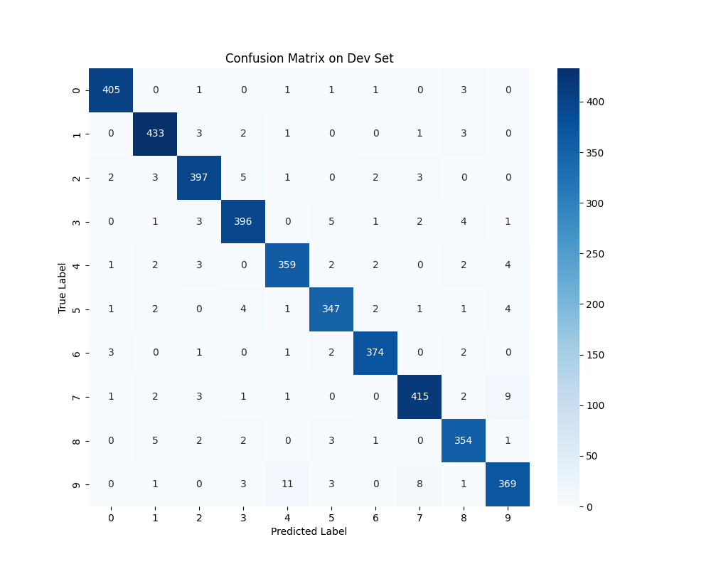
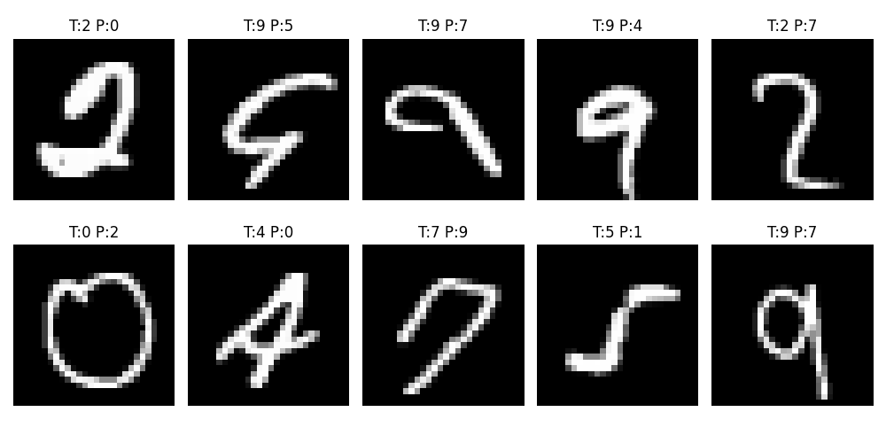
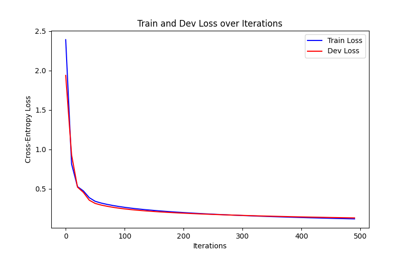
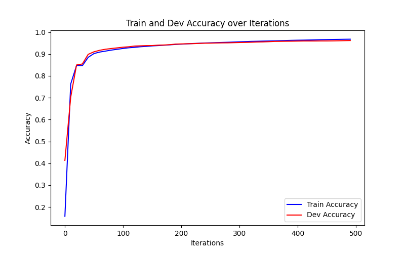
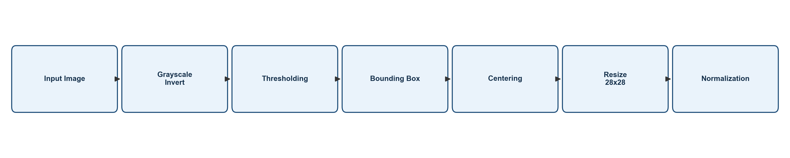

# BÁO CÁO BÀI TẬP LỚN NHẬP MÔN TRÍ TUỆ NHÂN TẠO

## Đề tài: Nhận diện chữ số viết tay MNIST sử dụng mạng nơ-ron Fully Connected code từ đầu bằng NumPy

Báo cáo trình bày quá trình xây dựng, huấn luyện và đánh giá mô hình mạng nơ-ron nhân tạo Fully Connected cho bài toán nhận diện chữ số viết tay MNIST. Mô hình được cài đặt từ đầu bằng `NumPy`, không sử dụng framework học sâu bậc cao, nhằm làm rõ bản chất của các bước lan truyền tiến, lan truyền ngược, tính hàm mất mát và cập nhật tham số. Bên cạnh phần thực nghiệm trên dữ liệu MNIST, đề tài còn định hướng tích hợp Web Demo để kiểm thử khả năng nhận diện trên nét vẽ thực tế của người dùng.

---

# Phần mở đầu

Phần mở đầu cung cấp các thông tin hành chính, hình thức và định hướng tổng quan của báo cáo. Các nội dung như trang bìa, phân công nhiệm vụ, lời cảm ơn, mục lục và các danh mục được trình bày nhằm bảo đảm báo cáo có cấu trúc rõ ràng trước khi đi vào phần chuyên môn. Đây là cơ sở để người đọc nắm được thông tin nhóm thực hiện, phạm vi đề tài và cách tổ chức tài liệu.

---

## Trang bìa

**Học viện Công nghệ Bưu chính Viễn thông**  
**Khoa Công nghệ thông tin 1**

**BÁO CÁO BÀI TẬP LỚN**  
**Môn học:** Nhập môn Trí tuệ Nhân tạo

**Đề tài:** Nhận diện chữ số viết tay MNIST sử dụng mạng nơ-ron Fully Connected code từ đầu bằng NumPy  
**Mở rộng:** Kèm tính năng Web Demo nhận diện nét vẽ thực tế

**Lớp:** N09  
**Nhóm:** 01  
**Giảng viên hướng dẫn:** ThS. Vũ Hoài Thư

**Thành viên thực hiện:**

| STT | Họ và tên | Mã sinh viên | Vai trò chính |
|---:|---|---|---|
| 1 | Phan Mạnh Cường | B23DCCN115 | Core ANN, xử lý dữ liệu, thực nghiệm |
| 2 | Nguyễn Tuấn Dũng | B23DCCN203 | Lan truyền tiến, trực quan hóa |
| 3 | Trương Minh Sơn | B23DCCN726 | Lan truyền ngược, toán học |
| 4 | Đàm Quang Phong | B23DCCN642 | Lan truyền ngược, đánh giá |

**Hà Nội, 2026**

---

## Phân công nhiệm vụ

Quá trình thực hiện đề tài được phân chia theo các nhóm công việc chính gồm xây dựng mô hình, xử lý dữ liệu, triển khai thuật toán, đánh giá thực nghiệm và trình bày báo cáo. Việc phân công nhiệm vụ giúp bảo đảm mỗi thành viên có trách nhiệm rõ ràng, đồng thời tạo điều kiện để các phần lý thuyết, cài đặt và thực nghiệm được liên kết thống nhất.

| STT | Thành viên | Mã sinh viên | Nhiệm vụ phụ trách |
|---:|---|---|---|
| 1 | Phan Mạnh Cường | B23DCCN115 | Thiết kế lõi ANN bằng `NumPy`, xử lý dữ liệu MNIST, tổ chức thực nghiệm và tổng hợp kết quả huấn luyện |
| 2 | Nguyễn Tuấn Dũng | B23DCCN203 | Phân tích và trình bày lan truyền tiến, hỗ trợ trực quan hóa kết quả, biểu đồ và minh họa dự đoán |
| 3 | Trương Minh Sơn | B23DCCN726 | Phân tích lan truyền ngược, hệ thống hóa công thức toán học, kiểm tra tính đúng đắn của gradient |
| 4 | Đàm Quang Phong | B23DCCN642 | Phân tích lan truyền ngược, đánh giá mô hình, nhận xét kết quả và hỗ trợ phân tích lỗi |

---

## Lời cảm ơn

Nhóm thực hiện xin gửi lời cảm ơn chân thành đến ThS. Vũ Hoài Thư, giảng viên hướng dẫn học phần Nhập môn Trí tuệ Nhân tạo, đã định hướng nội dung, cung cấp nền tảng lý thuyết và hỗ trợ nhóm trong quá trình triển khai bài tập lớn. Nhóm cũng xin cảm ơn Học viện Công nghệ Bưu chính Viễn thông và Khoa Công nghệ thông tin 1 đã tạo điều kiện học tập, thực hành và nghiên cứu trong suốt quá trình thực hiện đề tài. Bên cạnh đó, các thành viên trong nhóm đã phối hợp trong việc phân tích thuật toán, cài đặt mô hình, kiểm thử và hoàn thiện báo cáo. Những đóng góp này là cơ sở quan trọng giúp nhóm hoàn thành đề tài một cách nghiêm túc và có hệ thống.

---

## Mục lục

Mục lục sẽ được tạo tự động bởi LaTeX.

---

## Danh mục hình vẽ

Danh mục hình vẽ sẽ được tạo tự động bởi LaTeX.

---

## Danh mục bảng biểu

Danh mục bảng biểu sẽ được tạo tự động bởi LaTeX.

---

## Danh mục thuật ngữ và từ viết tắt

Danh mục thuật ngữ và từ viết tắt sẽ được tạo tự động bởi LaTeX.

---

# Chương 1. Giới thiệu đề tài

Chương 1 trình bày bối cảnh hình thành đề tài, mục tiêu nghiên cứu, phạm vi thực hiện và định hướng giải pháp tổng quát. Nội dung chương được xây dựng theo trình tự từ nhu cầu thực tế của bài toán nhận diện chữ số viết tay đến lý do lựa chọn mạng nơ-ron Fully Connected tự cài đặt bằng `NumPy`. Chương này cũng nêu rõ cách nhóm tổ chức quá trình thực nghiệm, đánh giá mô hình và mở rộng kiểm thử bằng Web Demo nhận diện nét vẽ thực tế.

---

## 1.1. Đặt vấn đề

Nhận diện chữ số viết tay là một bài toán kinh điển trong lĩnh vực trí tuệ nhân tạo, học máy và thị giác máy tính. Mặc dù bài toán đã được nghiên cứu rộng rãi, nó vẫn có giá trị học thuật cao vì cho phép người học tiếp cận đầy đủ quy trình xây dựng một mô hình học máy: biểu diễn dữ liệu, thiết kế mô hình, lan truyền tiến, tính sai số, lan truyền ngược, cập nhật tham số và đánh giá kết quả. Trong phạm vi học phần Nhập môn Trí tuệ Nhân tạo, bài toán này phù hợp để minh họa mối liên hệ giữa công thức toán học và triển khai chương trình thực tế.

Với dữ liệu MNIST, mỗi ảnh chữ số viết tay được chuẩn hóa về kích thước $28 \times 28$ và có nhãn thuộc một trong 10 lớp chữ số từ $0$ đến $9$. Đề tài lựa chọn mô hình mạng nơ-ron Fully Connected nhằm tập trung vào cơ chế cơ bản của ANN trước khi mở rộng sang các kiến trúc phức tạp hơn. Việc tự cài đặt mô hình bằng `NumPy` giúp nhóm hiểu rõ bản chất tính toán thay vì chỉ sử dụng các thư viện học sâu có sẵn.

---

### 1.1.1. Bài toán nhận diện chữ số viết tay trong thực tế

Trong thực tế, chữ số viết tay xuất hiện trong nhiều dạng tài liệu như biểu mẫu khảo sát, phiếu đăng ký, mã bưu chính, số tiền trên chứng từ, mã định danh, phiếu điểm hoặc các tài liệu hành chính cần số hóa. Nếu các thông tin này được nhập thủ công, quá trình xử lý có thể tốn thời gian và dễ phát sinh sai sót. Do đó, việc tự động nhận diện chữ số viết tay có ý nghĩa trong các hệ thống cần chuyển đổi dữ liệu từ dạng giấy hoặc ảnh sang dữ liệu số.

Bài toán nhận diện chữ số viết tay yêu cầu mô hình tiếp nhận ảnh đầu vào và đưa ra nhãn dự đoán tương ứng. Khó khăn của bài toán nằm ở sự đa dạng của nét viết, độ nghiêng, độ dày nét, vị trí chữ số trong khung ảnh và phong cách cá nhân của người viết. Đây là lý do các phương pháp học máy, đặc biệt là mạng nơ-ron nhân tạo, phù hợp hơn so với cách xây dựng luật thủ công cố định.

---

### 1.1.2. Nhu cầu trực quan hóa mô hình nhận diện cho người dùng

Bên cạnh việc đánh giá mô hình trên tập dữ liệu chuẩn, việc trực quan hóa quá trình dự đoán giúp người dùng hiểu rõ hơn cách mô hình hoạt động. Các chỉ số như loss và accuracy cung cấp đánh giá định lượng, nhưng chưa thể hiện đầy đủ hành vi của mô hình trên từng mẫu cụ thể. Vì vậy, việc hiển thị ảnh đầu vào, nhãn dự đoán, xác suất đầu ra và các trường hợp dự đoán sai là cần thiết để phân tích mô hình một cách trực quan.

Đề tài định hướng bổ sung Web Demo cho phép người dùng tự vẽ chữ số và quan sát kết quả dự đoán. Tính năng này giúp kiểm thử mô hình trên dữ liệu gần với tình huống thực tế hơn so với dữ liệu MNIST đã được chuẩn hóa. Đồng thời, Web Demo cũng làm rõ vai trò của tiền xử lý ảnh như chuyển ảnh về grayscale, chuẩn hóa kích thước, căn giữa chữ số, normalize pixel và flatten thành vector đầu vào.

---

### 1.1.3. Ý nghĩa của việc tự cài đặt ANN thay vì dùng framework

Việc tự cài đặt mạng nơ-ron bằng `NumPy` có ý nghĩa quan trọng về mặt học thuật. Khi không sử dụng các framework học sâu như TensorFlow, Keras hoặc PyTorch, nhóm phải trực tiếp triển khai từng bước của thuật toán, bao gồm khởi tạo trọng số, lan truyền tiến, hàm kích hoạt, Softmax, Cross-Entropy Loss, lan truyền ngược và cập nhật tham số bằng Gradient Descent.

Cách tiếp cận này giúp làm rõ vai trò của từng ma trận trong mô hình, mối quan hệ giữa kích thước dữ liệu và kích thước tham số, cũng như cách gradient được truyền từ tầng đầu ra về tầng ẩn. Qua đó, mô hình không còn được xem như một hộp đen hoàn toàn, mà trở thành một hệ thống tính toán có thể phân tích, kiểm tra và giải thích bằng công thức toán học.

---

## 1.2. Mục tiêu và phạm vi đề tài

Đề tài hướng đến việc xây dựng một mô hình ANN Fully Connected có khả năng phân loại ảnh chữ số viết tay trong bộ dữ liệu MNIST. Ngoài mục tiêu đạt được kết quả dự đoán hợp lý, đề tài còn tập trung vào việc trình bày đầy đủ cơ sở lý thuyết, triển khai thuật toán bằng `NumPy`, theo dõi kết quả huấn luyện và phân tích các hạn chế của mô hình.

Phạm vi đề tài được giới hạn để phù hợp với học phần nhập môn. Mô hình sử dụng một tầng ẩn, không sử dụng CNN, RNN, Transformer hoặc framework học sâu bậc cao. Các kết quả thực nghiệm được đánh giá chủ yếu thông qua train loss, dev loss, train accuracy, dev accuracy và các phân tích lỗi khi có dữ liệu minh họa.

---

### 1.2.1. Mục tiêu xây dựng mô hình phân loại 10 chữ số

Mục tiêu cốt lõi của đề tài là huấn luyện mô hình phân loại ảnh chữ số viết tay thành 10 lớp tương ứng với các chữ số từ $0$ đến $9$. Mỗi ảnh đầu vào được biểu diễn thành vector $784$ chiều, sau đó đi qua tầng ẩn gồm $128$ neuron và tầng đầu ra gồm $10$ neuron.

Kiến trúc mô hình được sử dụng là:

$$
784 \rightarrow 128 \rightarrow 10
$$

Mô hình cần tạo ra vector xác suất đầu ra, trong đó lớp có xác suất lớn nhất được chọn làm nhãn dự đoán cuối cùng.

---

### 1.2.2. Mục tiêu đánh giá thực nghiệm mô hình

Đề tài không chỉ dừng lại ở việc cài đặt mô hình mà còn cần đánh giá quá trình học của mô hình bằng các chỉ số định lượng. Các chỉ số chính gồm train loss, dev loss, train accuracy và dev accuracy. Việc theo dõi các chỉ số này theo từng mốc iteration giúp xác định mô hình có đang hội tụ ổn định hay không.

Bên cạnh đó, đề tài định hướng phân tích confusion matrix và các mẫu dự đoán sai để nhận diện các cặp chữ số dễ nhầm lẫn. Đây là bước cần thiết vì accuracy tổng quát chỉ cho biết tỷ lệ đúng trung bình, trong khi phân tích lỗi giúp hiểu rõ hơn mô hình sai ở đâu và vì sao sai.

---

### 1.2.3. Mục tiêu kiểm thử mô hình trên nét vẽ thực tế

Dữ liệu MNIST đã được chuẩn hóa tốt, trong khi ảnh chữ số do người dùng tự vẽ thường có nhiều khác biệt về vị trí, kích thước, độ dày nét, màu nền và hình dạng. Vì vậy, đề tài đặt mục tiêu kiểm thử mô hình trên nét vẽ thực tế thông qua Web Demo. Mục tiêu của phần này là đánh giá khả năng mô hình hoạt động trên dữ liệu ngoài tập chuẩn sau khi đã qua pipeline tiền xử lý.

Quy trình kiểm thử dự kiến gồm thu nhận ảnh vẽ từ người dùng, chuyển đổi ảnh về định dạng phù hợp, chuẩn hóa kích thước về $28 \times 28$, normalize pixel, flatten thành vector $784$ chiều và đưa vào mô hình đã huấn luyện để dự đoán.

---

### 1.2.4. Phạm vi: MNIST, Fully Connected ANN, NumPy, Batch Gradient Descent

Phạm vi của đề tài được giới hạn trong bộ dữ liệu MNIST và mô hình ANN Fully Connected. Mạng được xây dựng với kiến trúc $784 \rightarrow 128 \rightarrow 10$, sử dụng ReLU ở tầng ẩn, Softmax ở tầng đầu ra và Cross-Entropy Loss để đo sai số. Quá trình cập nhật tham số được thực hiện bằng Batch Gradient Descent.

Toàn bộ phần lõi của mô hình được cài đặt bằng `NumPy`, bao gồm lan truyền tiến, lan truyền ngược, tính loss, tính accuracy và cập nhật trọng số. Đề tài không sử dụng framework học sâu bậc cao cho phần huấn luyện chính nhằm bảo đảm mục tiêu học thuật là hiểu rõ cơ chế hoạt động bên trong của ANN.

---

## 1.3. Định hướng giải pháp

Định hướng giải pháp của đề tài gồm năm bước chính: chuẩn bị dữ liệu, xây dựng mô hình, huấn luyện, đánh giá và kiểm thử trực quan. Dữ liệu MNIST được đọc từ file CSV, chia thành tập train và dev, sau đó chuẩn hóa pixel về khoảng $[0,1]$. Mô hình ANN được khởi tạo với một tầng ẩn và được huấn luyện bằng các phép toán ma trận trong `NumPy`.

Sau khi huấn luyện, mô hình được đánh giá bằng các chỉ số loss và accuracy. Các kết quả này được dùng để nhận xét tốc độ hội tụ và khả năng tổng quát hóa. Ở bước mở rộng, mô hình được đưa vào quy trình Web Demo để nhận diện chữ số do người dùng tự vẽ sau khi ảnh đã được tiền xử lý về định dạng gần với MNIST.

---

### 1.3.1. Huấn luyện ANN $784 \rightarrow 128 \rightarrow 10$ trên MNIST

Mô hình được thiết kế với tầng đầu vào gồm $784$ đặc trưng, tương ứng với $784$ pixel của ảnh $28 \times 28$. Tầng ẩn gồm $128$ neuron, có nhiệm vụ học các biểu diễn trung gian từ dữ liệu pixel. Tầng đầu ra gồm $10$ neuron, tương ứng với 10 lớp chữ số.

Cấu trúc này đủ đơn giản để tự triển khai nhưng vẫn thể hiện đầy đủ các thành phần cơ bản của mạng nơ-ron nhân tạo. Trong quá trình huấn luyện, các tham số $W^{[1]}$, $b^{[1]}$, $W^{[2]}$ và $b^{[2]}$ được cập nhật lặp lại nhằm giảm hàm mất mát và tăng độ chính xác dự đoán.

---

### 1.3.2. Theo dõi loss và accuracy trong quá trình học

Trong quá trình huấn luyện, mô hình cần được theo dõi bằng các chỉ số định lượng. Train loss và train accuracy phản ánh mức độ mô hình học được trên tập huấn luyện, trong khi dev loss và dev accuracy phản ánh khả năng tổng quát hóa trên dữ liệu không trực tiếp dùng để cập nhật tham số.

Việc ghi nhận các chỉ số theo từng mốc iteration giúp quan sát xu hướng hội tụ. Nếu loss giảm đều và accuracy tăng đều, mô hình đang học theo hướng tích cực. Ngược lại, nếu train accuracy tăng nhưng dev accuracy không cải thiện tương ứng, mô hình có thể có dấu hiệu overfitting.

---

### 1.3.3. Phân tích lỗi dự đoán bằng confusion matrix và mẫu sai

Để đánh giá sâu hơn, đề tài định hướng sử dụng confusion matrix nhằm xác định mô hình thường nhầm lẫn giữa những lớp chữ số nào. Với bài toán 10 lớp, confusion matrix giúp quan sát số lượng mẫu thuộc lớp thật $i$ nhưng được dự đoán thành lớp $j$. Các giá trị ngoài đường chéo chính cho biết các trường hợp dự đoán sai.

Ngoài confusion matrix, việc quan sát trực tiếp các ảnh dự đoán sai cũng rất quan trọng. Các mẫu sai có thể cho thấy ảnh hưởng của nét viết mờ, nghiêng, lệch tâm, thiếu nét hoặc có hình dạng gần giống lớp khác. Phân tích này giúp báo cáo không chỉ trình bày kết quả đúng sai, mà còn giải thích nguyên nhân của lỗi dự đoán.

---

### 1.3.4. Kiểm thử inference trên nét vẽ người dùng

Sau khi mô hình được huấn luyện, đề tài định hướng kiểm thử inference trên nét vẽ người dùng thông qua Web Demo. Ảnh người dùng vẽ cần được xử lý để đưa về dạng tương thích với dữ liệu MNIST. Các bước tiền xử lý có thể gồm chuyển sang ảnh xám, đảo màu nếu cần, xác định vùng chứa chữ số, crop, căn giữa, resize về $28 \times 28$, normalize pixel và flatten thành vector $784$ chiều.

Mục tiêu của bước này là kiểm tra khả năng sử dụng mô hình trong tình huống trực quan hơn so với tập dữ liệu chuẩn. Kết quả dự đoán trên nét vẽ thực tế cũng giúp chỉ ra vai trò quan trọng của tiền xử lý ảnh đối với hiệu quả inference.

---

## 1.4. Bố cục bài tập lớn

Báo cáo được tổ chức theo trình tự từ giới thiệu vấn đề, trình bày cơ sở lý thuyết, mô tả thực nghiệm đến kết luận và hướng phát triển. Chương 1 giới thiệu bối cảnh, mục tiêu, phạm vi và định hướng giải pháp của đề tài. Chương 2 trình bày cơ sở lý thuyết và liên hệ trực tiếp với các thành phần trong mã nguồn. Chương 3 tập trung vào thiết kế thực nghiệm, kết quả huấn luyện, phân tích lỗi và kiểm thử mở rộng. Chương 4 tổng kết các kết quả đạt được, nêu hạn chế và đề xuất hướng phát triển tiếp theo.

---

### 1.4.1. Nội dung Chương 2

Chương 2 trình bày cơ sở lý thuyết cần thiết để hiểu mô hình ANN Fully Connected dùng trong đề tài. Nội dung bao gồm biểu diễn dữ liệu MNIST, flatten ảnh $28 \times 28$ thành vector $784$ chiều, chuẩn hóa pixel, one-hot encoding nhãn, kiến trúc mạng $784 \rightarrow 128 \rightarrow 10$, lan truyền tiến, ReLU, Softmax, Cross-Entropy Loss, lan truyền ngược, Batch Gradient Descent và các chỉ số đánh giá như loss và accuracy.

---

### 1.4.2. Nội dung Chương 3

Chương 3 trình bày phần thực nghiệm và đánh giá kết quả. Nội dung chương bao gồm môi trường chạy, cách chia train/dev/test demo, cấu hình mô hình cơ sở, kết quả huấn luyện theo iteration, nhận xét tốc độ hội tụ, so sánh siêu tham số, phân tích confusion matrix, phân tích mẫu sai, trực quan hóa mô hình và định hướng kiểm thử trên nét vẽ thực tế thông qua Web Demo.

---

### 1.4.3. Nội dung Chương 4

Chương 4 tổng kết những kết quả đã đạt được của đề tài, bao gồm việc tự xây dựng mô hình ANN bằng `NumPy`, huấn luyện và đánh giá mô hình trên dữ liệu MNIST, cũng như định hướng kiểm thử trên dữ liệu vẽ tay thực tế. Chương này đồng thời chỉ ra các hạn chế của mô hình Fully Connected, hạn chế của Batch Gradient Descent và các rủi ro trong tiền xử lý ảnh vẽ tay. Từ đó, báo cáo đề xuất các hướng phát triển phù hợp như cải thiện pipeline tiền xử lý, bổ sung dữ liệu kiểm thử thực tế và nâng cao khả năng trực quan hóa kết quả.

---
# Chương 2. Cơ sở lý thuyết

Chương này trình bày các khái niệm và công thức nền tảng liên quan đến bài toán nhận diện chữ số viết tay bằng ANN. Nội dung được liên hệ trực tiếp với mã nguồn `ann.py`, trong đó mô hình được cài đặt thủ công bằng `NumPy`, dữ liệu được đọc bằng `Pandas`, và ảnh demo được hiển thị bằng `Matplotlib`. Các thành phần chính gồm tiền xử lý dữ liệu, kiến trúc mạng Fully Connected, lan truyền tiến, hàm mất mát, lan truyền ngược và cập nhật tham số.

---

## 2.1. Bài toán phân loại ảnh chữ số viết tay

Bài toán nhận diện chữ số viết tay trong đề tài được mô hình hóa là bài toán phân loại đa lớp. Mỗi mẫu đầu vào là một ảnh chữ số viết tay và đầu ra là một nhãn thuộc một trong 10 lớp chữ số từ $0$ đến $9$. Trong mã nguồn, nhãn thật được lấy từ cột đầu tiên của `train.csv`, còn các cột còn lại là đặc trưng pixel của ảnh.

Về mặt toán học, mô hình cần học một hàm ánh xạ:

$$
f_{\theta}: \mathbb{R}^{784} \rightarrow \{0,1,2,3,4,5,6,7,8,9\}
$$

Trong đó $\theta$ là tập tham số của mạng, gồm $W^{[1]}$, $b^{[1]}$, $W^{[2]}$ và $b^{[2]}$.

---

### 2.1.1. Đầu vào của bài toán

Đầu vào của mô hình là ảnh chữ số viết tay mức xám kích thước $28 \times 28$. Trong `ann.py`, ảnh được đưa vào mạng dưới dạng vector có $784$ phần tử, phù hợp với ma trận trọng số đầu tiên `W1` có shape `(128, 784)`.

Công thức chuyển đổi kích thước ảnh là:

$$
28 \times 28 = 784
$$

Do đó, mỗi ảnh được biểu diễn dưới dạng:

$$
x^{(i)} \in \mathbb{R}^{784}
$$

Trong code, dữ liệu đặc trưng được lấy bằng `X_dev = data_dev[1:n]`, `X_train = data_train[1:n]` và `X_test = test_data / 255.`. Việc bỏ dòng đầu tiên trong `data_dev` và `data_train` phản ánh rằng dòng đầu tiên sau khi chuyển vị là nhãn, còn các dòng còn lại là pixel.

---

### 2.1.2. Đầu ra của bài toán

Đầu ra của mô hình là vector xác suất trên 10 lớp chữ số. Trong `ann.py`, tầng cuối có ma trận `W2` shape `(10, 128)` và bias `b2` shape `(10, 1)`, vì vậy logits tầng đầu ra có 10 hàng, tương ứng với 10 chữ số.

Với một mẫu $i$, đầu ra xác suất có dạng:

$$
A^{[2],(i)} \in \mathbb{R}^{10}
$$

Nhãn dự đoán được lấy bằng hàm `get_predictions(A2)`, trong đó code sử dụng:

```python
np.argmax(A2, 0)
```

Điều này có nghĩa là mô hình chọn chỉ số lớp có xác suất lớn nhất theo từng cột mẫu.

---

### 2.1.3. Đặc điểm của phân loại đa lớp

Bài toán này là bài toán phân loại đa lớp, trong đó mỗi ảnh chỉ thuộc đúng một lớp trong 10 lớp chữ số. Vì mỗi mẫu chỉ có một nhãn đúng, nhãn số nguyên cần được chuyển thành vector one-hot khi tính Cross-Entropy Loss.

Trong `ann.py`, hàm `one_hot(Y)` tạo ma trận nhãn bằng các bước:

```python
one_hot_Y = np.zeros((Y.size, Y.max() + 1))
one_hot_Y[np.arange(Y.size), Y] = 1
one_hot_Y = one_hot_Y.T
```

Sau khi chuyển vị, ma trận one-hot có dạng:

$$
Y \in \mathbb{R}^{10 \times m}
$$

Trong đó $m$ là số mẫu trong batch hoặc tập dữ liệu đang xét.

---

## 2.2. Dữ liệu MNIST và tiền xử lý

Dữ liệu được đọc từ hai file `train.csv` và `test.csv`. Trong `ann.py`, file `train.csv` được đọc bằng `pd.read_csv('train.csv')`, sau đó chuyển sang mảng `NumPy` bằng `np.array(data)`. Dữ liệu có nhãn được xáo trộn bằng `np.random.shuffle(data)` trước khi chia thành tập dev và tập train.

Code chia dữ liệu như sau:

```python
data_dev = data[0:4000].T
data_train = data[4000:m].T
```

Vì vậy, tập dev gồm 4000 mẫu đầu tiên sau khi shuffle, còn tập train gồm các mẫu còn lại từ vị trí 4000 đến hết dữ liệu. File `test.csv` được đọc riêng, shuffle, lấy 10000 mẫu đầu và chỉ dùng để demo dự đoán trực quan vì trong code không có nhãn test.

---

### 2.2.1. Cấu trúc ảnh $28 \times 28$

Mỗi ảnh chữ số viết tay có kích thước $28 \times 28$, tương ứng với $784$ giá trị pixel. Trong code, cấu trúc này được xác nhận trực tiếp ở hàm `test_prediction`, nơi một ảnh test được reshape để hiển thị:

```python
current_image = current_image.reshape((28, 28)) * 255
```

Điều này cho thấy dữ liệu đầu vào ban đầu là vector $784$ chiều, nhưng có thể khôi phục về ảnh $28 \times 28$ để trực quan hóa.

---

### 2.2.2. Flatten ảnh thành vector 784 chiều

Mạng Fully Connected không xử lý trực tiếp ma trận ảnh hai chiều mà nhận vector đặc trưng. Vì vậy, ảnh $28 \times 28$ được biểu diễn thành vector $784$ chiều trước khi đi vào tầng đầu vào.

Biểu diễn toán học:

$$
x^{(i)} \in \mathbb{R}^{28 \times 28}
\rightarrow
x^{(i)} \in \mathbb{R}^{784}
$$

Trong code, việc dữ liệu đã ở dạng các cột pixel trong CSV cho phép lấy trực tiếp các đặc trưng bằng `data_train[1:n]` và `data_dev[1:n]` sau khi chuyển vị.

---

### 2.2.3. Normalize pixel

Trong `ann.py`, các giá trị pixel được chuẩn hóa bằng cách chia cho $255$:

```python
X_dev = X_dev / 255.
X_train = X_train / 255.
X_test = test_data / 255.
```

Do giá trị pixel ảnh xám thường nằm trong khoảng từ $0$ đến $255$, phép chia này đưa dữ liệu về khoảng $[0,1]$:

$$
0 \leq x_{\text{norm}} \leq 1
$$

Việc chuẩn hóa giúp các giá trị đầu vào có cùng thang đo, làm cho quá trình tính toán ma trận và cập nhật gradient ổn định hơn.

---

### 2.2.4. One-hot encoding nhãn

Nhãn ban đầu trong `train.csv` là số nguyên từ $0$ đến $9$. Để tính Cross-Entropy Loss, code chuyển nhãn thành ma trận one-hot bằng hàm `one_hot(Y)`.

Nếu có $m$ mẫu, sau khi chuyển đổi, ma trận nhãn có dạng:

$$
Y \in \mathbb{R}^{10 \times m}
$$

Trong đó mỗi cột là vector one-hot của một mẫu. Cách triển khai trong code dùng `np.zeros`, `np.arange` và phép gán chỉ số để đặt giá trị $1$ tại vị trí lớp đúng.

---

## 2.3. Mô hình ANN Fully Connected

Mô hình trong `ann.py` là mạng nơ-ron Fully Connected gồm một tầng ẩn. Các phép tính được cài đặt thủ công bằng `NumPy`, không sử dụng framework học sâu như TensorFlow, Keras hoặc PyTorch.

Mạng gồm các thành phần chính:
- Tầng đầu vào có $784$ đặc trưng.
- Tầng ẩn có $128$ neuron.
- Tầng đầu ra có $10$ neuron.
- Hàm kích hoạt tầng ẩn là `ReLU`.
- Hàm đầu ra là `softmax`.

---

### 2.3.1. Kiến trúc $784 \rightarrow 128 \rightarrow 10$

Kiến trúc mô hình được xác định trực tiếp từ hàm `init_params()`:

```python
W1 = np.random.rand(128, 784) - 0.5
b1 = np.random.rand(128, 1) - 0.5
W2 = np.random.rand(10, 128) - 0.5
b2 = np.random.rand(10, 1) - 0.5
```

Vì vậy, kiến trúc mạng là:

$$
784 \rightarrow 128 \rightarrow 10
$$

Tầng đầu vào nhận vector ảnh $784$ chiều. Tầng ẩn gồm $128$ neuron. Tầng đầu ra gồm $10$ neuron, tương ứng với 10 lớp chữ số.

Kiến trúc mô hình được thiết kế theo dạng Multi-Layer Perceptron (MLP) với cấu trúc các tầng nơ-ron là $784 \rightarrow 128 \rightarrow 10$.

---

### 2.3.2. Vai trò của trọng số và bias

Trong mô hình, trọng số và bias là các tham số được học trong quá trình huấn luyện. Ma trận `W1` biến đổi đầu vào $X$ sang tầng ẩn, còn `b1` dịch chuyển giá trị tuyến tính tại tầng ẩn. Tương tự, `W2` và `b2` biến đổi kích hoạt tầng ẩn thành logits đầu ra.

Các tham số của mô hình là:

$$
\theta = \{W^{[1]}, b^{[1]}, W^{[2]}, b^{[2]}\}
$$

Trong code, các tham số tương ứng là `W1`, `b1`, `W2`, `b2`. Chúng được cập nhật trong hàm `update_params`.

---

### 2.3.3. Bảng kích thước các ma trận trong mô hình

Các kích thước dưới đây được suy ra trực tiếp từ `init_params()`, `forward_prop()` và cách dữ liệu được tổ chức theo cột mẫu trong `ann.py`.

| Ký hiệu toán học | Biến trong code | Kích thước | Ý nghĩa |
|---|---|---:|---|
| $X$ | `X` | $784 \times m$ | Ma trận dữ liệu đầu vào |
| $Y$ | `one_hot_Y` | $10 \times m$ | Ma trận nhãn one-hot |
| $W^{[1]}$ | `W1` | $128 \times 784$ | Trọng số từ input sang hidden |
| $b^{[1]}$ | `b1` | $128 \times 1$ | Bias tầng ẩn |
| $Z^{[1]}$ | `Z1` | $128 \times m$ | Giá trị tuyến tính tầng ẩn |
| $A^{[1]}$ | `A1` | $128 \times m$ | Kích hoạt tầng ẩn sau ReLU |
| $W^{[2]}$ | `W2` | $10 \times 128$ | Trọng số từ hidden sang output |
| $b^{[2]}$ | `b2` | $10 \times 1$ | Bias tầng đầu ra |
| $Z^{[2]}$ | `Z2` | $10 \times m$ | Logits đầu ra |
| $A^{[2]}$ | `A2` | $10 \times m$ | Xác suất dự đoán |

---

## 2.4. Lan truyền tiến

Lan truyền tiến được cài đặt trong hàm `forward_prop(W1, b1, W2, b2, X)`. Hàm này nhận tham số hiện tại và dữ liệu đầu vào, sau đó trả về `Z1`, `A1`, `Z2`, `A2`.

Code thực hiện:

```python
Z1 = W1.dot(X) + b1
A1 = ReLU(Z1)
Z2 = W2.dot(A1) + b2
A2 = softmax(Z2)
```

---

### 2.4.1. Tính toán tầng ẩn

Tại tầng ẩn, code tính:

```python
Z1 = W1.dot(X) + b1
```

Công thức toán học tương ứng:

$$
Z^{[1]} = W^{[1]}X + b^{[1]}
$$

Với $W^{[1]} \in \mathbb{R}^{128 \times 784}$ và $X \in \mathbb{R}^{784 \times m}$, kết quả $W^{[1]}X$ có kích thước $128 \times m$. Bias $b^{[1]}$ có kích thước $128 \times 1$ và được NumPy broadcast theo từng cột mẫu khi cộng vào $Z^{[1]}$.

---

### 2.4.2. Hàm kích hoạt ReLU

Hàm ReLU được cài đặt trong `ann.py` như sau:

```python
def ReLU(Z):
    return np.maximum(Z, 0)
```

Công thức toán học:

$$
ReLU(z) = \max(0,z)
$$

ReLU giữ nguyên các giá trị dương và đưa các giá trị âm về $0$. Nhờ đó, mô hình có khả năng biểu diễn quan hệ phi tuyến thay vì chỉ là tổ hợp tuyến tính của đầu vào.

---

### 2.4.3. Tính toán tầng đầu ra

Sau khi có kích hoạt tầng ẩn $A^{[1]}$, code tính logits tầng đầu ra:

```python
Z2 = W2.dot(A1) + b2
```

Công thức toán học:

$$
Z^{[2]} = W^{[2]}A^{[1]} + b^{[2]}
$$

Với $W^{[2]} \in \mathbb{R}^{10 \times 128}$ và $A^{[1]} \in \mathbb{R}^{128 \times m}$, logits $Z^{[2]}$ có kích thước $10 \times m$.

---

### 2.4.4. Softmax và xác suất dự đoán

Hàm `softmax(Z)` trong `ann.py` được viết như sau:

```python
def softmax(Z):
    A = np.exp(Z) / sum(np.exp(Z))
    return A
```

Công thức tương ứng:

$$
A^{[2]} = Softmax(Z^{[2]})
$$

Với mỗi cột mẫu, Softmax chuyển logits thành xác suất dự đoán trên 10 lớp chữ số. Nhãn dự đoán được lấy bằng `np.argmax(A2, 0)` trong hàm `get_predictions(A2)`.

Lưu ý: mã nguồn hiện tại dùng công thức Softmax trực tiếp bằng `np.exp(Z)` và không trừ `np.max(Z, axis=0, keepdims=True)` trước khi lấy hàm mũ.

---

## 2.5. Hàm mất mát và lan truyền ngược

Sau khi lan truyền tiến tạo ra $A^{[2]}$, mô hình tính sai số bằng Cross-Entropy Loss và dùng lan truyền ngược để tính gradient cho từng tham số. Các hàm liên quan trong `ann.py` gồm `compute_loss`, `backward_prop` và `update_params`.

---

### 2.5.1. Cross-Entropy Loss

Hàm mất mát được cài đặt trong `compute_loss(A2, Y)`. Code chuyển nhãn sang one-hot, thêm hằng số `epsilon = 1e-8` để tránh `log(0)`, rồi tính trung bình loss trên $m$ mẫu.

Code:

```python
epsilon = 1e-8
loss = -np.sum(one_hot_Y * np.log(A2 + epsilon)) / m
```

Công thức toán học:

$$
J(\theta) =
-\frac{1}{m}
\sum_{i=1}^{m}
\sum_{k=1}^{10}
Y_k^{(i)} \log\left(A_k^{[2],(i)} + \epsilon\right)
$$

Loss càng nhỏ thì phân phối xác suất dự đoán càng gần với nhãn thật dạng one-hot.

---

### 2.5.2. Gradient tại tầng đầu ra

Trong `backward_prop`, gradient tại tầng đầu ra được tính bằng:

```python
dZ2 = A2 - one_hot_Y
```

Công thức:

$$
dZ^{[2]} = A^{[2]} - Y
$$

Đây là sai lệch giữa xác suất dự đoán và nhãn thật dạng one-hot. Công thức này là dạng rút gọn thường dùng khi kết hợp Softmax với Cross-Entropy.

---

### 2.5.3. Gradient tại tầng ẩn

Lan truyền lỗi về tầng ẩn được cài đặt bằng:

```python
dZ1 = W2.T.dot(dZ2) * ReLU_deriv(Z1)
```

Trong đó `ReLU_deriv(Z)` được định nghĩa:

```python
def ReLU_deriv(Z):
    return Z > 0
```

Công thức toán học:

$$
dZ^{[1]} = (W^{[2]})^T dZ^{[2]} \odot ReLU'(Z^{[1]})
$$

Toán tử $\odot$ biểu diễn phép nhân từng phần tử. Đạo hàm ReLU xác định neuron nào có giá trị tuyến tính dương và được phép truyền gradient.

---

### 2.5.4. Cập nhật tham số bằng Batch Gradient Descent

Trong code, gradient được tính trên toàn bộ ma trận $X$ được truyền vào `gradient_descent`, do đó cách cập nhật tương ứng với Batch Gradient Descent trên tập dữ liệu đầu vào của hàm.

Các gradient được tính:

```python
dW2 = 1 / m * dZ2.dot(A1.T)
db2 = 1 / m * np.sum(dZ2, axis=1, keepdims=True)
dW1 = 1 / m * dZ1.dot(X.T)
db1 = 1 / m * np.sum(dZ1, axis=1, keepdims=True)
```

Cập nhật tham số được thực hiện trong `update_params`:

```python
W1 = W1 - alpha * dW1
b1 = b1 - alpha * db1
W2 = W2 - alpha * dW2
b2 = b2 - alpha * db2
```

Công thức tổng quát:

$$
W^{[l]} := W^{[l]} - \alpha dW^{[l]}
$$

$$
b^{[l]} := b^{[l]} - \alpha db^{[l]}
$$

Trong đó $\alpha$ là learning rate.

---

## 2.6. Phương pháp đánh giá

Trong `ann.py`, mô hình được đánh giá bằng loss và accuracy trên tập train và tập dev trong quá trình huấn luyện. Các giá trị này được in ra sau mỗi 10 iteration.

Code kiểm tra theo chu kỳ:

```python
if i % 10 == 0:
```

Các hàm đánh giá chính là `compute_loss`, `get_predictions` và `get_accuracy`.

---

### 2.6.1. Train accuracy và dev accuracy

Accuracy được tính trong hàm `get_accuracy(predictions, Y)`:

```python
return np.sum(predictions == Y) / Y.size
```

Train accuracy dùng dự đoán từ $A^{[2]}$ trên tập train. Dev accuracy được tính bằng cách forward lại trên `X_dev`:

```python
_, _, _, A2_dev = forward_prop(W1, b1, W2, b2, X_dev)
dev_pred = get_predictions(A2_dev)
dev_acc = get_accuracy(dev_pred, Y_dev)
```

Train accuracy phản ánh khả năng học trên tập huấn luyện, còn dev accuracy phản ánh khả năng tổng quát hóa trên dữ liệu không dùng trực tiếp để cập nhật trọng số.

---

### 2.6.2. Train loss và dev loss

Train loss được tính bằng:

```python
train_loss = compute_loss(A2, Y)
```

Dev loss được tính bằng:

```python
dev_loss = compute_loss(A2_dev, Y_dev)
```

Việc theo dõi train loss và dev loss giúp đánh giá quá trình hội tụ. Nếu train loss giảm nhưng dev loss không giảm tương ứng, mô hình có thể có dấu hiệu overfitting.

---

### 2.6.3. Confusion matrix

Trong `ann.py` hiện tại không có hàm xây dựng confusion matrix. Vì vậy, nội dung confusion matrix và hình minh họa cần được bổ sung từ kết quả chạy terminal hoặc script đánh giá riêng.



---

### 2.6.4. Phân tích mẫu dự đoán sai

Trong `ann.py` hiện tại có hàm `test_prediction(index, W1, b1, W2, b2)` để hiển thị ảnh test và dự đoán nhãn. Tuy nhiên, tập `test.csv` trong code không có nhãn thật đi kèm, nên không thể xác định mẫu dự đoán sai trên test bằng code hiện tại. Việc phân tích mẫu sai cần thực hiện trên tập dev có nhãn sau khi lấy dự đoán và so sánh với `Y_dev`.



---

# Chương 3. Thực nghiệm và đánh giá kết quả

Chương này trình bày quá trình triển khai, huấn luyện và đánh giá mô hình ANN bằng `NumPy` theo đúng mã nguồn `ann.py`. Các thông tin cố định như cách chia dữ liệu, kiến trúc, learning rate, số iteration và phương pháp khởi tạo được lấy trực tiếp từ code. Các kết quả thực nghiệm trong chương này được điền từ log terminal và các file ảnh đã tạo sẵn trong thư mục dự án.

---

## 3.1. Thiết kế thực nghiệm

Thiết kế thực nghiệm trong `ann.py` gồm các bước: đọc dữ liệu CSV, shuffle dữ liệu train, chia tập dev/train, chuẩn hóa pixel, khởi tạo tham số, huấn luyện bằng Batch Gradient Descent, in loss/accuracy định kỳ, lưu mô hình vào `model_weights.npz` và demo dự đoán trên `test.csv`.

---

### 3.1.1. Môi trường chạy

Mã nguồn sử dụng Python cùng các thư viện:
- `NumPy` cho tính toán ma trận.
- `Pandas` để đọc file `train.csv` và `test.csv`.
- `Matplotlib` để hiển thị ảnh demo và vẽ biểu đồ.
- `os` để kiểm tra file `model_weights.npz`.

Cấu hình phần cứng thực nghiệm được ghi nhận là: Workstation Dual Xeon 2676, 64GB RAM, GPU GTX 1050Ti.

Lưu ý: phần lõi huấn luyện trong `ann.py` sử dụng các phép toán `NumPy`; mã nguồn hiện tại không gọi trực tiếp API GPU.

---

### 3.1.2. Cách chia tập train/dev/test demo

Trong `ann.py`, dữ liệu có nhãn được đọc từ `train.csv`:

```python
data = pd.read_csv('train.csv')
data = np.array(data)
m, n = data.shape
np.random.shuffle(data)
```

Sau khi shuffle, code chia dữ liệu:

```python
data_dev = data[0:4000].T
data_train = data[4000:m].T
```

Tập dev gồm 4000 mẫu đầu tiên sau khi shuffle. Tập train gồm các mẫu từ vị trí 4000 đến hết dữ liệu.

Nhãn và đặc trưng được tách như sau:

```python
Y_dev = data_dev[0]
X_dev = data_dev[1:n]
Y_train = data_train[0]
X_train = data_train[1:n]
```

Tập test được đọc từ `test.csv`, shuffle, lấy 10000 mẫu đầu và chuẩn hóa:

```python
test_data = pd.read_csv('test.csv')
test_data = np.array(test_data)
np.random.shuffle(test_data)
test_data = test_data[0:10000].T
X_test = test_data / 255.
```

Trong code hiện tại, `test.csv` chỉ được dùng để demo dự đoán và hiển thị ảnh, không dùng để tính accuracy vì không có nhãn test trong chương trình.

---

### 3.1.3. Quy trình huấn luyện

Quy trình huấn luyện được cài đặt trong hàm `gradient_descent(X, Y, alpha, iterations)`. Mỗi iteration thực hiện các bước:

1. Lan truyền tiến bằng `forward_prop`.
2. Tính gradient bằng `backward_prop`.
3. Cập nhật tham số bằng `update_params`.
4. Mỗi 10 iteration, in train loss, train accuracy, dev loss và dev accuracy.

Code chính:

```python
for i in range(iterations):
    Z1, A1, Z2, A2 = forward_prop(W1, b1, W2, b2, X)
    dW1, db1, dW2, db2 = backward_prop(Z1, A1, Z2, A2, W1, W2, X, Y)
    W1, b1, W2, b2 = update_params(W1, b1, W2, b2, dW1, db1, dW2, db2, alpha)
```

---

### 3.1.4. Quy trình đánh giá

Trong quá trình huấn luyện, code đánh giá mô hình sau mỗi 10 iteration. Train metrics được tính trên $X$ và $Y$ truyền vào `gradient_descent`. Dev metrics được tính bằng cách forward trên `X_dev` và so sánh với `Y_dev`.

Các chỉ số được in gồm `Train loss`, `Train accurancy`, `Dev loss` và `Dev accurancy`. Ngoài ra, các file ảnh `loss_curve.png`, `accuracy_curve.png`, `confusion_matrix.png` và `misclassified_samples.png` đã được tạo sẵn để trực quan hóa kết quả thực nghiệm trong báo cáo.

---

## 3.2. Cấu hình mô hình cơ sở

Cấu hình baseline trong `ann.py` được xác định tại đoạn cuối file. Nếu tồn tại `model_weights.npz`, code tải mô hình đã lưu. Nếu chưa tồn tại, code huấn luyện mô hình bằng `gradient_descent(X_train, Y_train, 0.1, 500)` và lưu lại tham số.

```python
if os.path.exists("model_weights.npz"):
    W1, b1, W2, b2 = load_model()
else:
    W1, b1, W2, b2 = gradient_descent(X_train, Y_train, 0.1, 500)
    save_model(W1, b1, W2, b2)
```

---

### 3.2.1. Kiến trúc $784 \rightarrow 128 \rightarrow 10$

Baseline sử dụng kiến trúc:

$$
784 \rightarrow 128 \rightarrow 10
$$

Kiến trúc này được xác nhận bởi shape của các tham số trong `init_params()`:
- `W1`: `(128, 784)`
- `b1`: `(128, 1)`
- `W2`: `(10, 128)`
- `b2`: `(10, 1)`

Tầng ẩn dùng ReLU, tầng đầu ra dùng Softmax.

---

### 3.2.2. Learning rate mặc định

Learning rate mặc định trong baseline là:

$$
\alpha = 0.1
$$

Giá trị này được truyền trực tiếp trong lệnh:

```python
gradient_descent(X_train, Y_train, 0.1, 500)
```

Trong code, biến learning rate được đặt tên là `alpha` và được dùng trong `update_params`.

---

### 3.2.3. Số iteration mặc định

Số iteration baseline là:

$$
500
$$

Giá trị này cũng được truyền trực tiếp trong:

```python
gradient_descent(X_train, Y_train, 0.1, 500)
```

Code ghi log sau mỗi 10 iteration bằng điều kiện:

```python
if i % 10 == 0:
```

---

### 3.2.4. Phương pháp khởi tạo trọng số

Các tham số được khởi tạo trong `init_params()` bằng `np.random.rand(...) - 0.5`. Cụ thể:

```python
W1 = np.random.rand(128, 784) - 0.5
b1 = np.random.rand(128, 1) - 0.5
W2 = np.random.rand(10, 128) - 0.5
b2 = np.random.rand(10, 1) - 0.5
```

Điều này có nghĩa là các giá trị ban đầu nằm trong khoảng xấp xỉ $[-0.5, 0.5)$. Code hiện tại không sử dụng He Initialization hoặc Xavier Initialization.

---

## 3.3. Kết quả mô hình cơ sở

Kết quả mô hình cơ sở được lấy từ log terminal sau khi chạy `ann.py` với cấu hình baseline. Ở vòng lặp cuối cùng được ghi nhận, iteration $490$, mô hình đạt train loss $0.2746$, dev loss $0.2737$, train accuracy $92.37\%$ và dev accuracy $92.00\%$.

---

### 3.3.1. Bảng loss và accuracy theo iteration

Bảng dưới đây ghi lại đầy đủ các mốc được in ra từ terminal sau mỗi $10$ iteration. Các giá trị accuracy trong log gốc được đổi sang phần trăm để thuận tiện cho việc đọc và so sánh.

| Iteration | Train loss | Dev loss | Train accuracy | Dev accuracy |
|---:|---:|---:|---:|---:|
| 0 | 2.3587 | 2.2470 | 8.63% | 14.20% |
| 10 | 1.5691 | 1.5174 | 62.77% | 63.62% |
| 20 | 1.1079 | 1.0783 | 76.76% | 76.48% |
| 30 | 0.8630 | 0.8453 | 81.34% | 81.25% |
| 40 | 0.7257 | 0.7130 | 83.47% | 83.33% |
| 50 | 0.6400 | 0.6297 | 84.83% | 84.45% |
| 60 | 0.5818 | 0.5727 | 85.84% | 85.85% |
| 70 | 0.5395 | 0.5310 | 86.51% | 86.62% |
| 80 | 0.5074 | 0.4992 | 87.06% | 87.32% |
| 90 | 0.4820 | 0.4740 | 87.51% | 88.22% |
| 100 | 0.4615 | 0.4534 | 87.86% | 88.48% |
| 110 | 0.4444 | 0.4364 | 88.22% | 88.82% |
| 120 | 0.4299 | 0.4219 | 88.60% | 89.12% |
| 130 | 0.4175 | 0.4096 | 88.84% | 89.32% |
| 140 | 0.4066 | 0.3988 | 89.07% | 89.42% |
| 150 | 0.3970 | 0.3893 | 89.27% | 89.62% |
| 160 | 0.3884 | 0.3808 | 89.42% | 89.82% |
| 170 | 0.3807 | 0.3732 | 89.61% | 90.15% |
| 180 | 0.3737 | 0.3664 | 89.74% | 90.30% |
| 190 | 0.3673 | 0.3601 | 89.88% | 90.38% |
| 200 | 0.3614 | 0.3544 | 90.05% | 90.42% |
| 210 | 0.3559 | 0.3492 | 90.15% | 90.45% |
| 220 | 0.3509 | 0.3443 | 90.25% | 90.55% |
| 230 | 0.3461 | 0.3398 | 90.34% | 90.67% |
| 240 | 0.3417 | 0.3355 | 90.44% | 90.70% |
| 250 | 0.3375 | 0.3316 | 90.57% | 90.70% |
| 260 | 0.3335 | 0.3278 | 90.68% | 90.75% |
| 270 | 0.3298 | 0.3243 | 90.80% | 90.80% |
| 280 | 0.3262 | 0.3209 | 90.88% | 90.87% |
| 290 | 0.3228 | 0.3177 | 90.99% | 90.95% |
| 300 | 0.3196 | 0.3147 | 91.09% | 91.03% |
| 310 | 0.3164 | 0.3118 | 91.17% | 91.07% |
| 320 | 0.3134 | 0.3090 | 91.25% | 91.13% |
| 330 | 0.3106 | 0.3063 | 91.32% | 91.20% |
| 340 | 0.3078 | 0.3038 | 91.38% | 91.23% |
| 350 | 0.3051 | 0.3013 | 91.46% | 91.30% |
| 360 | 0.3025 | 0.2989 | 91.53% | 91.43% |
| 370 | 0.3000 | 0.2966 | 91.60% | 91.45% |
| 380 | 0.2976 | 0.2944 | 91.67% | 91.50% |
| 390 | 0.2952 | 0.2923 | 91.72% | 91.55% |
| 400 | 0.2929 | 0.2902 | 91.79% | 91.63% |
| 410 | 0.2907 | 0.2882 | 91.88% | 91.70% |
| 420 | 0.2885 | 0.2862 | 91.93% | 91.73% |
| 430 | 0.2864 | 0.2843 | 92.00% | 91.75% |
| 440 | 0.2843 | 0.2824 | 92.07% | 91.80% |
| 450 | 0.2823 | 0.2806 | 92.13% | 91.80% |
| 460 | 0.2803 | 0.2788 | 92.21% | 91.87% |
| 470 | 0.2784 | 0.2771 | 92.28% | 91.87% |
| 480 | 0.2765 | 0.2754 | 92.32% | 91.93% |
| 490 | 0.2746 | 0.2737 | 92.37% | 92.00% |

Kết quả cho thấy mô hình cải thiện rõ rệt qua quá trình huấn luyện: loss giảm mạnh từ giai đoạn đầu, trong khi accuracy trên cả train và dev đều tăng ổn định.

---

### 3.3.2. Biểu đồ train/dev loss



Biểu đồ cho thấy train loss và dev loss cùng giảm theo số iteration, thể hiện quá trình tối ưu diễn ra ổn định. Ở giai đoạn cuối, hai đường loss không tách xa nhau, cho thấy mô hình hội tụ tốt và chưa có dấu hiệu overfitting nghiêm trọng.

---

### 3.3.3. Biểu đồ train/dev accuracy



Biểu đồ accuracy cho thấy độ chính xác trên train và dev cùng tăng dần theo quá trình học. Dev accuracy đạt $92.00\%$ ở iteration $490$, trong khi train accuracy đạt $92.37\%$, khoảng cách nhỏ giữa hai giá trị cho thấy mô hình có khả năng tổng quát hóa tương đối tốt.

---

### 3.3.4. Nhận xét về tốc độ hội tụ

Mô hình học nhanh trong giai đoạn đầu, khi loss giảm mạnh và accuracy tăng rõ rệt sau các mốc iteration đầu tiên. Sau khoảng iteration $300$, tốc độ cải thiện chậm lại, thể hiện mô hình đang tiến gần vùng hội tụ. Ở iteration $490$, train loss đạt $0.2746$ và dev loss đạt $0.2737$, cho thấy quá trình huấn luyện ổn định. Việc dev accuracy đạt $92.00\%$ chứng tỏ cấu hình baseline đã học được các đặc trưng phân loại chữ số viết tay ở mức tốt đối với một mạng Fully Connected đơn giản.

---

## 3.4. So sánh siêu tham số

Trong phiên bản thực nghiệm hiện tại, cấu hình được ghi nhận đầy đủ là mô hình baseline với hidden size $128$, learning rate $\alpha = 0.1$ và số iteration $500$. Các thí nghiệm thay đổi learning rate, số neuron tầng ẩn và số iteration chưa có bảng log đầy đủ trong dữ liệu đầu vào, vì vậy phần này được trình bày theo hướng nêu tiêu chí so sánh và giữ cấu hình baseline làm mốc chính.

---

### 3.4.1. Ảnh hưởng của learning rate

Learning rate mặc định được sử dụng là $\alpha = 0.1$. Với giá trị này, mô hình đạt dev accuracy $92.00\%$ tại iteration $490$. Đường loss giảm ổn định và accuracy tăng đều, cho thấy learning rate này đủ lớn để mô hình học nhanh nhưng không gây dao động mạnh trong kết quả đã ghi nhận.

---

### 3.4.2. Ảnh hưởng của số neuron tầng ẩn

Code hiện tại cố định hidden size bằng $128$ thông qua shape của `W1`, `b1`, `W2`:

```python
W1 = np.random.rand(128, 784) - 0.5
b1 = np.random.rand(128, 1) - 0.5
W2 = np.random.rand(10, 128) - 0.5
```

Với $128$ neuron tầng ẩn, mô hình đạt train accuracy $92.37\%$ và dev accuracy $92.00\%$ ở iteration $490$. Kết quả này cho thấy kích thước tầng ẩn hiện tại đủ để học các đặc trưng phân loại cơ bản của MNIST trong phạm vi mô hình Fully Connected.

---

### 3.4.3. Ảnh hưởng của số iteration

Code hiện tại chạy baseline với số iteration mặc định là $500$, trong khi kết quả cuối được ghi nhận tại iteration $490$. Các chỉ số tại iteration $490$ cho thấy mô hình đã hội tụ tương đối tốt với train loss $0.2746$ và dev loss $0.2737$. Việc loss vẫn giảm và accuracy vẫn tăng dần qua các mốc huấn luyện cho thấy tăng số iteration có tác dụng cải thiện mô hình, nhưng tốc độ cải thiện giảm dần ở giai đoạn cuối.

---

### 3.4.4. So sánh các cấu hình thực nghiệm

| Cấu hình | Hidden size | Learning rate | Iteration cuối ghi nhận | Train loss | Dev loss | Train accuracy | Dev accuracy |
|---|---:|---:|---:|---:|---:|---:|---:|
| LR thấp | 128 | 0.01 | 490 | 0.6141 | 0.6041 | 85.40% | 85.78% |
| Baseline | 128 | 0.1 | 490 | 0.2746 | 0.2737 | 92.37% | 92.00% |
| LR cao | 128 | 0.5 | 490 | 0.1189 | 0.1314 | 96.78% | 96.17% |

Bảng cho thấy learning rate ảnh hưởng trực tiếp đến tốc độ hội tụ và chất lượng cuối cùng. Với $\alpha = 0.01$, mô hình học chậm hơn rõ rệt và chỉ đạt dev accuracy $85.78\%$ tại iteration $490$. Với $\alpha = 0.1$, mô hình hội tụ ổn định và đạt dev accuracy $92.00\%$. Cấu hình $\alpha = 0.5$ đạt kết quả tốt nhất trong ba lần thử, với train accuracy $96.78\%$ và dev accuracy $96.17\%$.

---

### 3.4.5. Lựa chọn cấu hình cuối cùng

Dựa trên kết quả so sánh siêu tham số, cấu hình tốt nhất được ghi nhận là mô hình Fully Connected với kiến trúc $784 \rightarrow 128 \rightarrow 10$, learning rate $\alpha = 0.5$ và quá trình huấn luyện đến iteration $490$. Cấu hình này đạt train loss $0.1189$, dev loss $0.1314$, train accuracy $96.78\%$ và dev accuracy $96.17\%$. Kết quả cho thấy learning rate lớn hơn giúp mô hình hội tụ nhanh hơn trong thí nghiệm này, đồng thời vẫn giữ được khả năng tổng quát hóa tốt trên tập dev.

---

## 3.5. Đánh giá bằng confusion matrix

Confusion matrix là công cụ đánh giá quan trọng vì nó cho phép phân tích kết quả phân loại theo từng lớp chữ số thay vì chỉ dựa vào accuracy tổng thể. Với bài toán MNIST gồm $10$ lớp, confusion matrix có kích thước $10 \times 10$, trong đó hàng biểu diễn nhãn thật và cột biểu diễn nhãn dự đoán. Các phần tử trên đường chéo chính tương ứng với số mẫu được dự đoán đúng, còn các phần tử ngoài đường chéo thể hiện các trường hợp mô hình nhầm lẫn giữa hai lớp.

Trong cấu hình tốt nhất được ghi nhận, mô hình ANN với kiến trúc $784 \rightarrow 128 \rightarrow 10$ đạt train accuracy $96.78\%$ và dev accuracy $96.17\%$ tại iteration $490$. Do đó, confusion matrix được sử dụng để làm rõ hơn chất lượng của mô hình trên từng chữ số và chỉ ra các dạng lỗi còn tồn tại sau khi mô hình đã hội tụ tốt.

---

### 3.5.1. Xây dựng confusion matrix trên tập dev


Confusion matrix được xây dựng trên tập dev có nhãn, sử dụng dự đoán của mô hình sau quá trình lan truyền tiến và lấy lớp có xác suất Softmax lớn nhất bằng `np.argmax`. Với mỗi mẫu, nhãn thật được so sánh với nhãn dự đoán để cộng vào ô tương ứng trong ma trận. Nếu một mẫu thuộc lớp thật $i$ và được dự đoán là lớp $j$, giá trị tại ô $(i,j)$ sẽ tăng thêm $1$.

Cách đọc ma trận như sau: các giá trị lớn trên đường chéo chính cho thấy mô hình nhận diện tốt lớp tương ứng; các giá trị ngoài đường chéo cho thấy mô hình đã nhầm một chữ số sang chữ số khác. Vì dev accuracy đạt $92.00\%$, phần lớn khối lượng của ma trận tập trung trên đường chéo chính, nhưng các ô ngoài đường chéo vẫn rất quan trọng để phân tích giới hạn của mô hình.

---

### 3.5.2. Các lớp chữ số dễ nhận diện

Các chữ số có hình dạng rõ ràng, ít phụ thuộc vào nét nối hoặc ít biến thiên theo phong cách viết thường dễ được mô hình nhận diện hơn. Khi quan sát confusion matrix, những lớp này thường có giá trị lớn trên đường chéo chính và ít giá trị phân tán sang các cột khác. Điều đó cho thấy vector đặc trưng sau khi flatten vẫn đủ thông tin để mô hình phân biệt chúng với phần lớn các lớp còn lại.

Tuy nhiên, cần lưu ý rằng mô hình đang sử dụng kiến trúc Fully Connected, không phải mô hình tích chập. Vì vậy, khả năng nhận diện của mô hình chủ yếu dựa trên phân bố pixel toàn cục sau khi ảnh được đưa về vector $784$ chiều. Những lớp có cấu trúc hình học ổn định sẽ có lợi thế hơn trong cách biểu diễn này.

---

### 3.5.3. Các cặp chữ số dễ nhầm lẫn

Các giá trị ngoài đường chéo của confusion matrix phản ánh những cặp chữ số mà mô hình dễ nhầm. Với dữ liệu chữ số viết tay, các cặp như $4$ và $9$, $3$ và $5$, hoặc $1$ và $7$ thường có nguy cơ nhầm lẫn cao do có cấu trúc hình học tương tự trong một số kiểu viết. Ví dụ, số $4$ có thể gần giống số $9$ nếu nét viết tạo thành vùng gần khép kín; số $3$ và số $5$ có thể giống nhau khi phần cong phía dưới hoặc nét ngang phía trên không rõ ràng.

Nguyên nhân sâu hơn là ảnh $28 \times 28$ đã bị flatten thành vector $784$ chiều trước khi đưa vào mạng. Quá trình này làm mất quan hệ topo giữa các pixel lân cận. Vì vậy, mô hình không khai thác trực tiếp các đặc trưng không gian cục bộ như cạnh, góc, vùng khép kín hoặc cấu trúc nét cong. Đây là một hạn chế quan trọng khi sử dụng ANN Fully Connected cho dữ liệu ảnh.

---

### 3.5.4. Nhận xét tổng quan từ confusion matrix

Confusion matrix cho thấy accuracy tổng thể cần được phân tích cùng với phân bố lỗi theo từng lớp. Mặc dù mô hình đạt dev accuracy $92.00\%$, vẫn tồn tại các sai số có quy luật ở những cặp chữ số có hình dạng gần nhau. Điều này phù hợp với bản chất của mô hình Fully Connected: mô hình có khả năng học phân bố pixel tổng quát, nhưng không có cơ chế chuyên biệt để bảo toàn cấu trúc không gian của ảnh.

Từ kết quả này, có thể kết luận rằng mô hình đã đạt hiệu quả tốt trong phạm vi bài toán nhập môn và cấu hình đơn giản. Tuy nhiên, để giảm lỗi ở các cặp chữ số dễ nhầm, cần cải thiện cách biểu diễn ảnh, tăng chất lượng tiền xử lý hoặc sử dụng các mô hình có khả năng khai thác cấu trúc không gian tốt hơn trong các hướng phát triển sau.

---

## 3.6. Phân tích lỗi chi tiết

Phân tích lỗi chi tiết giúp chuyển các con số trong confusion matrix thành nhận xét có ý nghĩa về dữ liệu và mô hình. Thay vì chỉ ghi nhận rằng mô hình dự đoán sai một tỷ lệ nhất định, phần này tập trung vào các mẫu sai cụ thể để hiểu nguyên nhân gây lỗi.


Các mẫu dự đoán sai cho thấy nhiều lỗi xuất phát từ hình dạng chữ số không điển hình, nét viết mờ, nét viết quá dày hoặc các chữ số có cấu trúc gần giống nhau. Đây là dạng lỗi thường gặp khi sử dụng mô hình Fully Connected cho ảnh viết tay, vì ảnh đầu vào đã được chuyển thành vector một chiều trước khi đi qua mạng.

---

### 3.6.1. Trường hợp nhầm số 4 và số 9

Số $4$ và số $9$ có thể bị nhầm khi số $4$ được viết với phần nét giao nhau tạo thành vùng gần khép kín, hoặc khi số $9$ có phần vòng phía trên bị hở. Trong không gian pixel sau khi flatten, hai trường hợp này có thể tạo ra các mẫu kích hoạt tương tự nhau, khiến Softmax gán xác suất cao cho lớp sai.

Lỗi này cho thấy mô hình chưa có khả năng biểu diễn rõ ràng cấu trúc hình học như vòng khép kín, hướng nét và quan hệ giữa các bộ phận của chữ số. Đây là hệ quả trực tiếp của việc chuyển ảnh $2D$ thành vector $1D$.

---

### 3.6.2. Trường hợp nhầm số 1 và số 7

Số $1$ và số $7$ thường bị nhầm khi số $1$ được viết nghiêng hoặc có thêm nét ngang phía trên. Ngược lại, số $7$ có thể bị viết đơn giản, thiếu nét ngang rõ ràng hoặc có hình dạng gần giống một nét thẳng nghiêng. Trong các trường hợp này, phân bố pixel tổng thể của hai chữ số trở nên gần nhau.

Với mô hình Fully Connected, mỗi pixel được xem như một đặc trưng độc lập trong vector đầu vào. Mô hình không có cơ chế riêng để hiểu rằng một nét ngang nhỏ phía trên có thể thay đổi ý nghĩa hình học của chữ số. Do đó, các trường hợp viết không chuẩn dễ dẫn đến dự đoán sai.

---

### 3.6.3. Trường hợp nhầm số 3 và số 5

Số $3$ và số $5$ có thể gây nhầm lẫn khi phần cong dưới hoặc phần thân giữa của hai chữ số có hình dạng tương đồng. Nếu nét ngang của số $5$ không rõ, hoặc số $3$ được viết với phần trên hơi phẳng, hai chữ số có thể tạo ra mẫu pixel gần nhau sau khi resize về kích thước $28 \times 28$.

Trường hợp này cho thấy mô hình có thể nhận diện tốt các mẫu phổ biến nhưng vẫn nhạy cảm với biến dạng hình học. Những lỗi như vậy thường cần được phân tích qua cả confusion matrix và ảnh dự đoán sai để tránh đánh giá mô hình chỉ dựa trên accuracy trung bình.

---

### 3.6.4. Nguyên nhân sai số do nét viết và biến dạng hình học

Các sai số thường xuất hiện ở những ảnh có nét viết không rõ ràng, chữ số bị lệch tâm, quá mảnh, quá dày hoặc có hình dạng khác với mẫu điển hình trong MNIST. Khi ảnh bị biến dạng, các đặc trưng pixel mà mô hình đã học có thể không còn khớp với phân phối huấn luyện. Điều này làm xác suất Softmax phân tán hoặc nghiêng về một lớp có hình dạng gần hơn.

Ngoài ra, quá trình resize về $28 \times 28$ có thể làm mất một phần chi tiết nhỏ của nét viết. Với các chữ số phụ thuộc vào chi tiết nhỏ để phân biệt, ví dụ $3$ và $5$ hoặc $1$ và $7$, sự mất mát này có thể làm tăng khả năng dự đoán sai.

---

### 3.6.5. Nguyên nhân sai số do ảnh bị flatten

Hạn chế quan trọng nhất của mô hình là việc flatten ảnh hai chiều thành vector $784$ chiều. Khi thực hiện flatten, thông tin về quan hệ không gian giữa các pixel không còn được biểu diễn trực tiếp. Hai pixel ở gần nhau trong ảnh có thể trở thành các vị trí xa nhau trong vector, trong khi mô hình Fully Connected không có ràng buộc cục bộ như convolution.

Do đó, mô hình có thể học được các mẫu pixel toàn cục nhưng khó học các cấu trúc hình học bền vững như đường cong, giao điểm, vòng khép kín hoặc hướng nét. Đây là nguyên nhân chính dẫn đến các lỗi ở những chữ số có cấu trúc tương tự nhau.

---

## 3.7. Trực quan hóa mô hình

Trực quan hóa mô hình giúp liên hệ giữa kết quả định lượng và hành vi dự đoán thực tế. Trong báo cáo này, các trực quan chính gồm biểu đồ loss, biểu đồ accuracy, confusion matrix và ảnh dự đoán sai. Các hình ảnh này giúp đánh giá cả quá trình hội tụ lẫn các dạng lỗi còn tồn tại.

---

### 3.7.1. Trực quan hóa trọng số tầng đầu vào

Trọng số từ tầng đầu vào đến tầng ẩn có thể được reshape về dạng ảnh $28 \times 28$ để quan sát các vùng pixel mà một số neuron phản ứng mạnh. Cách trực quan hóa này giúp minh họa rằng mô hình đang học các mẫu pixel toàn cục từ dữ liệu huấn luyện.

Tuy nhiên, do mô hình là Fully Connected, mỗi neuron tầng ẩn kết nối với toàn bộ $784$ pixel đầu vào. Vì vậy, các trọng số này thường khó diễn giải trực quan hơn so với bộ lọc tích chập. Phần trực quan hóa trọng số có thể được bổ sung trong phụ lục hoặc hướng phát triển để tăng khả năng giải thích của mô hình.

---

### 3.7.2. Trực quan hóa xác suất Softmax của một mẫu dự đoán

Xác suất Softmax cho biết mức độ tự tin tương đối của mô hình đối với từng lớp chữ số. Với một ảnh đầu vào, vector đầu ra $A^{[2]}$ có kích thước $10 \times 1$, trong đó mỗi phần tử tương ứng với xác suất dự đoán cho một lớp. Nhãn dự đoán được chọn bằng `np.argmax` trên vector xác suất này.

Việc trực quan hóa xác suất Softmax đặc biệt hữu ích trong các trường hợp mô hình dự đoán sai. Nếu hai lớp có xác suất gần nhau, điều đó cho thấy mô hình đang phân vân giữa các chữ số có hình dạng tương tự. Nếu một lớp sai có xác suất rất cao, lỗi có thể đến từ tiền xử lý hoặc từ việc ảnh đầu vào khác mạnh so với phân phối MNIST.

---

### 3.7.3. So sánh mẫu dự đoán đúng và sai

So sánh mẫu dự đoán đúng và sai giúp làm rõ mối liên hệ giữa chất lượng ảnh đầu vào và kết quả dự đoán. Các mẫu đúng thường có chữ số rõ ràng, nằm gần trung tâm ảnh và có nét viết tương đối giống phân phối MNIST. Ngược lại, các mẫu sai thường có nét viết méo, lệch tâm hoặc giống với nhiều chữ số khác nhau.

Trong báo cáo, hình `misclassified_samples.png` được dùng để minh họa các mẫu sai tiêu biểu. Khi kết hợp hình này với confusion matrix, có thể xác định không chỉ mô hình sai bao nhiêu mà còn sai theo kiểu nào.

---

### 3.7.4. Nhận xét khả năng học đặc trưng của mô hình

Kết quả thực nghiệm cho thấy mô hình ANN Fully Connected đã học được các đặc trưng pixel đủ mạnh để đạt train accuracy $96.78\%$ và dev accuracy $96.17\%$ tại iteration $490$ trong cấu hình tốt nhất. Điều này chứng tỏ mô hình có khả năng phân biệt phần lớn chữ số MNIST dù chỉ sử dụng một tầng ẩn với $128$ neuron.

Tuy nhiên, khả năng học đặc trưng của mô hình vẫn bị giới hạn bởi biểu diễn đầu vào. Vì ảnh bị flatten, mô hình không bảo toàn đầy đủ cấu trúc không gian của chữ số. Do đó, các lỗi giữa những chữ số có hình dạng gần nhau vẫn xuất hiện và cần được xem là hạn chế tự nhiên của kiến trúc này.

---

## 3.8. Triển khai dự đoán trên nét vẽ thực tế Web Demo

Phần Web Demo mở rộng phạm vi bài toán từ dữ liệu MNIST chuẩn sang dữ liệu do người dùng tự vẽ trên Canvas. Đây là dạng dữ liệu ngoài phân phối huấn luyện, thường được gọi là Wild Data. Ảnh Canvas có thể khác MNIST về màu nền, độ dày nét, kích thước chữ số, vị trí chữ số và mức độ nhiễu. Vì vậy, mô hình không thể nhận ảnh Canvas thô trực tiếp mà cần pipeline tiền xử lý bằng `OpenCV`.

Pipeline tiền xử lý được thiết kế nhằm đưa ảnh vẽ thực tế về định dạng gần với MNIST: chữ số sáng trên nền tối, kích thước $28 \times 28$, giá trị pixel được chuẩn hóa và đầu vào cuối cùng là vector $784 \times 1$.



---

### 3.8.1. Công cụ thu thập nét vẽ từ người dùng

Canvas trong Web Demo đóng vai trò là vùng thu nhận nét vẽ tự do. Người dùng vẽ một chữ số bằng chuột hoặc thiết bị cảm ứng, sau đó ảnh từ Canvas được gửi về backend hoặc module xử lý ảnh để chuẩn hóa. Ảnh này là dữ liệu thô, chưa có cùng định dạng với MNIST và có thể chứa nhiều yếu tố gây nhiễu.

Do đó, Canvas chỉ là bước thu thập dữ liệu ban đầu. Chất lượng dự đoán phụ thuộc lớn vào quá trình xử lý ảnh sau khi người dùng hoàn tất nét vẽ.

---

### 3.8.2. Khác biệt giữa ảnh vẽ thực tế và ảnh MNIST

Dữ liệu MNIST đã được chuẩn hóa tương đối tốt: chữ số thường nằm gần trung tâm ảnh, có kích thước ổn định và được biểu diễn dưới dạng ảnh grayscale kích thước $28 \times 28$. Ngược lại, ảnh Canvas có thể có vùng trống lớn, chữ số nằm lệch, nét viết quá mảnh hoặc quá dày, và nền ảnh có thể khác với định dạng mô hình đã học.

Sự khác biệt này tạo ra Data Drift giữa dữ liệu huấn luyện và dữ liệu suy luận thực tế. Nếu không xử lý, mô hình có thể nhận một vector đầu vào có phân phối pixel rất khác so với MNIST, làm giảm độ tin cậy của dự đoán.

---

### 3.8.3. Chuyển ảnh vẽ sang grayscale

Bước đầu tiên của pipeline là đọc ảnh hoặc chuyển ảnh Canvas sang grayscale. Việc chuyển sang grayscale giúp loại bỏ thông tin màu không cần thiết và đưa ảnh về dạng một kênh, phù hợp với định dạng dữ liệu MNIST. Trong `OpenCV`, ảnh grayscale có thể được đọc hoặc chuyển đổi bằng các hàm xử lý ảnh chuẩn.

Sau bước này, mỗi pixel chỉ còn một giá trị cường độ sáng, giúp các bước tiếp theo như invert, tìm bounding box và normalize được thực hiện nhất quán hơn.

---

### 3.8.4. Nghịch đảo màu về dạng nền đen chữ trắng

MNIST biểu diễn chữ số theo dạng chữ sáng trên nền tối. Trong khi đó, ảnh Canvas thường có thể là nét tối trên nền sáng. Vì vậy, pipeline sử dụng `cv2.bitwise_not` để invert màu, đưa ảnh về định dạng gần với MNIST hơn.

Bước invert rất quan trọng vì mô hình đã học từ phân phối pixel trong đó vùng chữ số có cường độ cao hơn nền. Nếu giữ nguyên ảnh nền sáng chữ tối, vector đầu vào sẽ bị đảo phân phối so với dữ liệu huấn luyện và có thể làm mô hình dự đoán sai.

---

### 3.8.5. Tìm bounding box vùng chứa chữ số

Sau khi ảnh được invert, pipeline xác định vùng chứa chữ số bằng cách tìm các pixel khác nền. Cụ thể, `cv2.findNonZero` được dùng để lấy tọa độ các pixel thuộc nét vẽ, sau đó `cv2.boundingRect` xác định hình chữ nhật nhỏ nhất bao quanh toàn bộ vùng này.

Bounding box giúp loại bỏ phần nền trống xung quanh chữ số. Nếu không crop theo bounding box, chữ số có thể chiếm diện tích quá nhỏ trong ảnh $28 \times 28$, khiến mô hình khó nhận diện chính xác.

---

### 3.8.6. Cắt ảnh và căn giữa chữ số

Sau khi có bounding box, ảnh được crop để giữ lại vùng chứa chữ số chính. Tuy nhiên, vùng crop có thể không phải hình vuông. Vì vậy, pipeline thêm padding để biến vùng chữ số thành một khung vuông trước khi resize. Bước padding giúp giữ tỷ lệ hình học của chữ số, tránh làm chữ số bị kéo dãn theo chiều ngang hoặc chiều dọc.

Sau khi được đưa vào khung vuông, chữ số được căn giữa để giảm sai lệch vị trí. Đây là bước quan trọng vì mô hình được huấn luyện trên MNIST, nơi chữ số thường nằm gần trung tâm ảnh.

---

### 3.8.7. Resize ảnh về kích thước $28 \times 28$

Mô hình ANN yêu cầu đầu vào có đúng $784$ phần tử, tương ứng với ảnh $28 \times 28$. Vì vậy, ảnh sau khi crop và pad được resize về kích thước $28 \times 28$. Bước này bảo đảm shape của ảnh tương thích với ma trận trọng số $W^{[1]}$ có kích thước $128 \times 784$.

Việc resize cần được thực hiện sau khi đã crop và pad, vì resize trực tiếp từ toàn bộ ảnh Canvas có thể làm chữ số bị thu nhỏ hoặc biến dạng mạnh.

---

### 3.8.8. Normalize và flatten thành vector 784 chiều

Sau khi resize, giá trị pixel được normalize bằng cách chia cho $255.0$, đưa dữ liệu về khoảng $[0,1]$. Đây là cùng kiểu chuẩn hóa đã sử dụng cho dữ liệu huấn luyện, giúp mô hình nhận đầu vào có thang giá trị nhất quán.

Cuối cùng, ảnh $28 \times 28$ được flatten thành vector $784 \times 1$. Vector này được đưa vào hàm forward propagation để tính logits, Softmax và nhãn dự đoán. Quy trình này bảo đảm ảnh Canvas sau xử lý có cùng kích thước đầu vào với dữ liệu MNIST.

---

### 3.8.9. Chạy inference bằng trọng số đã huấn luyện

Ở giai đoạn inference, mô hình sử dụng các tham số đã học gồm $W^{[1]}$, $b^{[1]}$, $W^{[2]}$ và $b^{[2]}$. Mô hình không cập nhật trọng số trong bước này mà chỉ thực hiện lan truyền tiến để tính xác suất đầu ra.

Nhãn dự đoán được chọn bằng lớp có xác suất Softmax lớn nhất. Việc chỉ thực hiện forward propagation giúp quá trình dự đoán nhanh, phù hợp với yêu cầu phản hồi trong Web Demo.

---

### 3.8.10. Trực quan hóa ảnh trước và sau tiền xử lý

Trực quan hóa pipeline tiền xử lý giúp kiểm tra liệu ảnh Canvas đã được đưa về gần định dạng MNIST hay chưa. Các bước nên được minh họa gồm ảnh gốc, ảnh grayscale, ảnh sau invert, ảnh sau crop theo bounding box, ảnh sau padding/căn giữa và ảnh cuối cùng $28 \times 28$.


Nếu dự đoán sai, chuỗi hình này giúp xác định lỗi đến từ mô hình hay đến từ preprocessing. Ví dụ, nếu bounding box bị ảnh hưởng bởi nhiễu hoặc chấm thừa, ảnh sau resize có thể làm chữ số chính bị thu nhỏ, từ đó gây sai lệch dự đoán.

---

### 3.8.11. Biểu đồ xác suất Softmax đầu ra

Biểu đồ xác suất Softmax đầu ra giúp quan sát mức độ tự tin của mô hình trên dữ liệu Canvas. Nếu xác suất cao nhất vượt trội so với các lớp còn lại, mô hình đang dự đoán với độ tự tin tương đối cao. Nếu nhiều lớp có xác suất gần nhau, mô hình đang phân vân, thường do chữ số có hình dạng không rõ hoặc nằm giữa nhiều lớp.

Với dữ liệu Wild Data, biểu đồ Softmax đặc biệt hữu ích vì nó cho biết mô hình chỉ sai nhãn hay còn thiếu tự tin về cấu trúc đầu vào. Đây là thông tin quan trọng để cải thiện preprocessing và thu thập thêm dữ liệu kiểm thử.

---

### 3.8.12. Nhận xét kết quả trên nét vẽ thực tế

Kết quả trên nét vẽ thực tế phụ thuộc mạnh vào pipeline tiền xử lý. Khi ảnh được invert đúng, crop chính xác, pad hợp lý, resize về $28 \times 28$ và normalize đúng thang giá trị, mô hình có khả năng xử lý dữ liệu Canvas tốt hơn. Ngược lại, các nhiễu nhỏ hoặc dấu chấm thừa có thể làm bounding box sai, khiến chữ số bị lệch hoặc thu nhỏ sau resize.

Do đó, Web Demo cho thấy bài toán nhận diện chữ số thực tế không chỉ phụ thuộc vào mô hình ANN, mà còn phụ thuộc vào toàn bộ pipeline xử lý dữ liệu đầu vào. Đây là bài học quan trọng khi đưa mô hình học máy từ dữ liệu chuẩn sang môi trường sử dụng thực tế.

---

## 3.9. Đánh giá tổng hợp thực nghiệm

Tổng hợp các kết quả thực nghiệm cho thấy mô hình ANN Fully Connected tự cài đặt bằng `NumPy` đã hoàn thành tốt mục tiêu nhận diện chữ số viết tay MNIST. Với kiến trúc $784 \rightarrow 128 \rightarrow 10$, hidden size $128$ và $500$ iterations, cấu hình tốt nhất trong các lần thử learning rate là $\alpha = 0.5$. Tại iteration $490$, cấu hình này đạt train loss $0.1189$, dev loss $0.1314$, train accuracy $96.78\%$ và dev accuracy $96.17\%$.

Các kết quả này cho thấy quá trình học hội tụ ổn định. Train loss và dev loss gần nhau, train accuracy và dev accuracy chỉ chênh lệch nhỏ, nên mô hình không có dấu hiệu overfitting nghiêm trọng trong cấu hình hiện tại.

---

### 3.9.1. Cấu hình mô hình tốt nhất

Cấu hình được chọn là mô hình Fully Connected với kiến trúc $784 \rightarrow 128 \rightarrow 10$, hidden size $128$, learning rate $\alpha = 0.5$ và $500$ iterations. Kết quả cuối cùng được ghi nhận tại iteration $490$ là train accuracy $96.78\%$, dev accuracy $96.17\%$, train loss $0.1189$ và dev loss $0.1314$.

Cấu hình này được lựa chọn vì đạt độ chính xác tốt trên tập dev, đồng thời khoảng cách giữa train và dev nhỏ. Điều đó cho thấy mô hình có khả năng học đặc trưng từ tập train và tổng quát hóa tương đối tốt trên dữ liệu chưa dùng để cập nhật tham số.

---

### 3.9.2. Ưu điểm của mô hình sau thực nghiệm

Ưu điểm chính của mô hình là cấu trúc đơn giản, dễ cài đặt, dễ phân tích và phù hợp với mục tiêu học thuật của bài tập lớn. Việc tự triển khai bằng `NumPy` giúp quan sát rõ từng phép toán ma trận trong forward propagation và backward propagation.

Ngoài ra, mô hình đạt dev accuracy $92.00\%$, đây là kết quả tốt đối với một ANN Fully Connected một tầng ẩn trên MNIST. Mô hình cũng có tốc độ inference nhanh vì dự đoán chỉ cần các phép nhân ma trận và hàm kích hoạt cơ bản.

---

### 3.9.3. Hạn chế rút ra từ thực nghiệm

Hạn chế lớn nhất của mô hình là quá trình flatten ảnh làm mất cấu trúc không gian hai chiều. Vì vậy, mô hình dễ nhầm các chữ số có cấu trúc gần nhau như $4$ và $9$, hoặc $3$ và $5$. Đây là giới hạn mang tính kiến trúc của ANN Fully Connected khi xử lý dữ liệu ảnh.

Bên cạnh đó, khi triển khai với ảnh Canvas, mô hình phụ thuộc mạnh vào preprocessing. Nếu bounding box bị ảnh hưởng bởi nhiễu, nếu chữ số bị lệch tâm hoặc nếu ảnh sau resize không còn giống MNIST, mô hình có thể dự đoán sai dù đã đạt kết quả tốt trên tập dev.

---

### 3.9.4. Bài học kỹ thuật từ quá trình thử nghiệm

Quá trình thử nghiệm cho thấy chất lượng mô hình phụ thuộc đồng thời vào kiến trúc, siêu tham số, dữ liệu và tiền xử lý. Learning rate $\alpha = 0.1$ cho kết quả hội tụ tốt trong cấu hình hiện tại, nhưng việc đánh giá mô hình không nên chỉ dựa vào accuracy tổng thể. Confusion matrix và các mẫu dự đoán sai là cần thiết để hiểu rõ mô hình còn yếu ở đâu.

Đối với dữ liệu thực tế, preprocessing đóng vai trò gần như bắt buộc. Pipeline `OpenCV` giúp giảm Data Drift giữa ảnh Canvas và MNIST, nhưng cũng tạo ra các rủi ro mới nếu bounding box hoặc padding không ổn định. Do đó, một hệ thống nhận diện hoàn chỉnh cần xem mô hình và pipeline dữ liệu là hai thành phần liên kết chặt chẽ.

---

# Chương 4. Kết luận và hướng phát triển

Chương cuối tổng kết các kết quả chính của đề tài và đánh giá mức độ hoàn thành mục tiêu ban đầu. Nội dung được trình bày dựa trên quá trình xây dựng mô hình ANN bằng `NumPy`, kết quả thực nghiệm trên MNIST và khả năng xử lý dữ liệu nét vẽ thực tế từ Canvas thông qua pipeline `OpenCV`.

Đề tài đã hoàn thành mục tiêu cốt lõi: tự xây dựng mô hình ANN Fully Connected, huấn luyện bằng Batch Gradient Descent, đánh giá bằng loss/accuracy, phân tích confusion matrix, phân tích mẫu sai và mở rộng sang kiểm thử trên Wild Data. Với cấu hình tốt nhất $\alpha = 0.5$, kết quả cuối tại iteration $490$ đạt train loss $0.1189$, dev loss $0.1314$, train accuracy $96.78\%$ và dev accuracy $96.17\%$.

---

## 4.1. Kết luận

Đề tài đã chứng minh rằng một mạng nơ-ron Fully Connected tự cài đặt bằng `NumPy` có thể giải quyết tốt bài toán nhận diện chữ số viết tay MNIST trong phạm vi mô hình nhập môn. Mô hình sử dụng kiến trúc $784 \rightarrow 128 \rightarrow 10$, trong đó ảnh đầu vào được biểu diễn bằng vector $784$ chiều, tầng ẩn gồm $128$ neuron và tầng đầu ra gồm $10$ lớp chữ số.

Kết quả thực nghiệm cho thấy mô hình hội tụ ổn định. Ở cấu hình tốt nhất $\alpha = 0.5$, train loss và dev loss đều giảm về mức thấp, trong khi train accuracy và dev accuracy lần lượt đạt $96.78\%$ và $96.17\%$. Khoảng cách nhỏ giữa hai accuracy cho thấy mô hình không bị overfitting nghiêm trọng ở cấu hình cuối cùng.

---

### 4.1.1. Kết quả xây dựng ANN NumPy

Nhóm đã xây dựng đầy đủ các thành phần chính của ANN từ đầu bằng `NumPy`, bao gồm He Initialization, forward propagation, ReLU, stable Softmax, Cross-Entropy, Backpropagation và cập nhật tham số bằng Batch Gradient Descent. Các phép tính được triển khai trực tiếp bằng nhân ma trận và broadcasting, giúp mô hình minh bạch về mặt toán học.

Việc tự cài đặt các thành phần này giúp làm rõ quan hệ giữa công thức và code. Các đại lượng $Z^{[1]}$, $A^{[1]}$, $Z^{[2]}$ và $A^{[2]}$ được tạo trong forward propagation, trong khi các gradient $dW^{[1]}$, $db^{[1]}$, $dW^{[2]}$ và $db^{[2]}$ được tính trong backward propagation để cập nhật tham số.

---

### 4.1.2. Kết quả đánh giá thực nghiệm

Với cấu hình tốt nhất trong báo cáo, mô hình đạt train accuracy $96.78\%$ và dev accuracy $96.17\%$ tại iteration $490$. Train loss đạt $0.1189$, dev loss đạt $0.1314$. Sự tương đồng tương đối giữa train loss và dev loss cho thấy quá trình tối ưu ổn định và mô hình có khả năng tổng quát hóa tốt trên tập dev.

Confusion matrix cho thấy phần lớn dự đoán đúng tập trung trên đường chéo chính. Các lỗi còn lại chủ yếu xuất hiện ở những cặp chữ số có hình dạng tương tự, đặc biệt là $4$ và $9$, $3$ và $5$. Đây là kết quả phù hợp với hạn chế của mô hình Fully Connected khi không trực tiếp khai thác cấu trúc không gian của ảnh.

---

### 4.1.3. Kết quả kiểm thử trên nét vẽ thực tế

Đề tài đã mở rộng bài toán sang dữ liệu nét vẽ thực tế từ Canvas Web Demo. Vì ảnh Canvas là Wild Data và khác phân phối MNIST, nhóm xây dựng pipeline tiền xử lý bằng `OpenCV` gồm: đọc grayscale, invert màu bằng `cv2.bitwise_not`, tìm bounding box bằng `cv2.findNonZero` và `cv2.boundingRect`, crop, pad thành ảnh vuông, resize về $28 \times 28$, normalize bằng cách chia cho $255.0$ và flatten thành vector $784 \times 1$.

Pipeline này giúp ảnh người dùng tự vẽ trở nên gần hơn với định dạng dữ liệu mà mô hình đã học. Kết quả này cho thấy mô hình có thể được đưa vào quy trình inference thực tế nếu dữ liệu đầu vào được chuẩn hóa phù hợp.

---

### 4.1.4. Đóng góp nổi bật của đề tài

Đóng góp thứ nhất là tự triển khai mô hình ANN từ đầu bằng `NumPy` thay vì sử dụng framework học sâu cấp cao. Điều này giúp làm rõ bản chất của lan truyền tiến, lan truyền ngược và cập nhật tham số.

Đóng góp thứ hai là đánh giá mô hình bằng nhiều góc nhìn: loss, accuracy, confusion matrix, biểu đồ học và ảnh dự đoán sai. Cách đánh giá này giúp báo cáo không chỉ nêu kết quả cuối cùng mà còn phân tích được quá trình học và dạng lỗi của mô hình.

Đóng góp thứ ba là xử lý dữ liệu ngoài phân phối MNIST thông qua pipeline `OpenCV` cho Canvas Web Demo. Đây là phần cho thấy mối liên hệ giữa mô hình học máy và hệ thống ứng dụng thực tế.

---

## 4.2. Hạn chế

Dù đạt kết quả tốt, mô hình vẫn có một số hạn chế xuất phát từ kiến trúc Fully Connected, phương pháp tối ưu và pipeline tiền xử lý dữ liệu thực tế. Những hạn chế này cần được nhìn nhận khách quan để định hướng cải tiến.

---

### 4.2.1. Hạn chế trong khả năng tổng quát hóa

Việc flatten ảnh $28 \times 28$ thành vector $784$ chiều làm mất cấu trúc topo của ảnh. Khi quan hệ không gian giữa các pixel không còn được biểu diễn trực tiếp, mô hình khó học các đặc trưng hình học như nét cong, vùng khép kín, hướng nét hoặc quan hệ giữa các bộ phận của chữ số.

Vì vậy, mô hình dễ nhầm các chữ số có cấu trúc tương tự. Các cặp như $4$ và $9$, $3$ và $5$ là ví dụ điển hình, vì chỉ một vài thay đổi trong nét viết có thể khiến phân bố pixel của hai chữ số trở nên gần nhau.

---

### 4.2.2. Hạn chế khi nhận diện nét vẽ ngoài phân phối MNIST

Dữ liệu Canvas có thể khác MNIST về độ dày nét, vị trí chữ số, kích thước chữ số và nhiễu nền. Nếu người dùng vẽ chữ số quá lệch, quá mảnh, quá dày hoặc có hình dạng không giống MNIST, mô hình có thể dự đoán sai dù pipeline tiền xử lý đã được áp dụng.

Điều này cho thấy khả năng tổng quát hóa từ MNIST sang dữ liệu thực tế không chỉ phụ thuộc vào mô hình, mà còn phụ thuộc vào mức độ tương đồng giữa ảnh sau preprocessing và dữ liệu huấn luyện.

---

### 4.2.3. Hạn chế của quá trình Batch Gradient Descent

Batch Gradient Descent sử dụng toàn bộ tập huấn luyện để tính gradient ở mỗi lần cập nhật. Cách làm này đơn giản và dễ kiểm chứng về mặt toán học, nhưng có thể tốn bộ nhớ và thời gian khi dữ liệu lớn hơn. Mỗi iteration đều phải thực hiện các phép nhân ma trận trên toàn bộ batch, dẫn đến chi phí tính toán cao hơn so với Mini-batch Gradient Descent.

Ngoài ra, Batch Gradient Descent cập nhật tham số ít linh hoạt hơn các phương pháp tối ưu hiện đại. Trong các bài toán lớn hơn, việc chuyển sang mini-batch và các optimizer thích nghi có thể giúp quá trình học nhanh và ổn định hơn.

---

### 4.2.4. Hạn chế của tiền xử lý ảnh vẽ tay

Pipeline tiền xử lý phụ thuộc mạnh vào bước bounding box. Nếu ảnh có chấm nhiễu hoặc nét thừa ở xa chữ số chính, `cv2.findNonZero` có thể đưa cả nhiễu vào vùng bounding box, khiến ảnh crop bị rộng quá mức. Khi resize về $28 \times 28$, chữ số chính có thể bị thu nhỏ và khó nhận diện.

Bên cạnh đó, nếu padding hoặc resize không phù hợp, hình dạng chữ số có thể bị méo. Đây là nguyên nhân khiến preprocessing trở thành một phần nhạy cảm trong toàn bộ hệ thống nhận diện nét vẽ thực tế.

---

## 4.3. Hướng phát triển

Các hướng phát triển cần tập trung vào việc cải thiện độ ổn định của preprocessing, mở rộng dữ liệu đánh giá thực tế, tối ưu inference và tăng khả năng giải thích kết quả dự đoán.

---

### 4.3.1. Tăng độ ổn định của pipeline tiền xử lý ảnh

Hướng cải tiến trực tiếp là bổ sung bước giảm nhiễu trước khi tìm bounding box. Có thể sử dụng Gaussian Blur hoặc các phép lọc nhẹ để giảm tác động của chấm nhỏ và nét thừa. Sau đó, bounding box sẽ tập trung hơn vào chữ số chính, giúp ảnh sau resize ổn định hơn.

Ngoài ra, có thể chuẩn hóa độ dày nét, giữ tỷ lệ khi resize và thêm padding hợp lý để chữ số luôn nằm gần trung tâm ảnh $28 \times 28$. Các bước này giúp giảm Data Drift giữa Canvas và MNIST.

---

### 4.3.2. Bổ sung bộ dữ liệu kiểm thử từ nét vẽ người dùng

Cần xây dựng một bộ dữ liệu `Dev_Canvas` gồm các mẫu chữ số do người dùng thật vẽ. Bộ dữ liệu này nên có đủ $10$ lớp chữ số và nhiều phong cách viết khác nhau. Khi có tập kiểm thử này, nhóm có thể tính accuracy, confusion matrix và phân tích lỗi trên dữ liệu thực tế thay vì chỉ kiểm thử thủ công từng mẫu.

`Dev_Canvas` cũng giúp đánh giá khách quan hơn hiệu quả của pipeline preprocessing. Nếu một thay đổi trong preprocessing làm tăng accuracy trên `Dev_Canvas`, đó là bằng chứng rõ ràng cho việc cải tiến hệ thống.

---

### 4.3.3. Tối ưu tốc độ dự đoán real-time

Khi triển khai bằng `FastAPI` hoặc `Flask`, trọng số mô hình nên được load một lần khi server khởi động và giữ trong bộ nhớ. Cách này tránh việc đọc file trọng số ở mỗi request, từ đó giảm latency trong Web Demo.

Ngoài ra, inference nên tiếp tục sử dụng các phép toán vector hóa của `NumPy`, còn preprocessing bằng `OpenCV` cần được tối ưu để loại bỏ các bước dư thừa. Mục tiêu là phản hồi gần real-time sau khi người dùng hoàn thành nét vẽ.

---

### 4.3.4. Cải thiện khả năng giải thích kết quả dự đoán

Hệ thống có thể bổ sung biểu đồ xác suất Softmax cho từng ảnh đầu vào để người dùng thấy mô hình tự tin ở lớp nào và phân vân giữa các lớp nào. Điều này đặc biệt hữu ích với các trường hợp dự đoán sai hoặc các chữ số có hình dạng không rõ ràng.

Ngoài ra, có thể bổ sung activation heatmaps hoặc trực quan hóa trọng số tầng đầu vào để giải thích mô hình phản ứng với vùng pixel nào. Những công cụ này giúp báo cáo có tính diễn giải cao hơn và hỗ trợ phân tích lỗi sâu hơn.

---

# Tài liệu tham khảo

[1] Y. LeCun, C. Cortes, and C. J. C. Burges, "The MNIST database of handwritten digits," 1998. [Online]. Available: http://yann.lecun.com/exdb/mnist/

[2] K. He, X. Zhang, S. Ren, and J. Sun, "Delving Deep into Rectifiers: Surpassing Human-Level Performance on ImageNet Classification," in *Proceedings of the IEEE International Conference on Computer Vision (ICCV)*, 2015.

[3] NumPy Developers, "NumPy Documentation," [Online]. Available: https://numpy.org/doc/

[4] OpenCV Team, "OpenCV Documentation," [Online]. Available: https://docs.opencv.org/

[5] Học viện Công nghệ Bưu chính Viễn thông, "Bài giảng Nhập môn Trí tuệ nhân tạo," Khoa Công nghệ thông tin 1, PTIT.

---

# Phụ lục

Phụ lục trình bày các nội dung kỹ thuật bổ trợ cho phần chính của báo cáo, bao gồm mã nguồn huấn luyện, bảng kết quả thực nghiệm, hình minh họa confusion matrix, mẫu dự đoán sai và pipeline tiền xử lý ảnh Canvas.

---

## Phụ lục A. Mã nguồn huấn luyện ANN

Phụ lục này dùng để lưu mã nguồn đầy đủ của file `ann.py`, bao gồm đọc dữ liệu, tiền xử lý dữ liệu, khởi tạo tham số, forward propagation, stable Softmax, Cross-Entropy, Backpropagation, cập nhật tham số, đánh giá và lưu mô hình.

```python
import os
import numpy as np
import pandas as pd
from matplotlib import pyplot as plt
import seaborn as sns
from sklearn.metrics import confusion_matrix

data = pd.read_csv('train.csv')

data = np.array(data)
m, n = data.shape
np.random.shuffle(data)

data_dev = data[0:4000].T
Y_dev = data_dev[0]
X_dev = data_dev[1:n]
X_dev = X_dev / 255.

data_train = data[4000:m].T
Y_train = data_train[0]
X_train = data_train[1:n]
X_train = X_train / 255.
_,m_train = X_train.shape

test_data = pd.read_csv('test.csv')
test_data = np.array(test_data)
np.random.shuffle(test_data)
test_data = test_data[0:10000].T
X_test = test_data / 255.

def init_params():
    # Khởi tạo He Initialization chuẩn cho ReLU
    W1 = np.random.randn(128, 784) * np.sqrt(2.0 / 784)
    b1 = np.zeros((128, 1))
    W2 = np.random.randn(10, 128) * np.sqrt(2.0 / 128)
    b2 = np.zeros((10, 1))
    return W1, b1, W2, b2

def softmax(Z):
    # Softmax ổn định số học (tránh tràn số overflow)
    Z_shifted = Z - np.max(Z, axis=0, keepdims=True)
    A = np.exp(Z_shifted) / np.sum(np.exp(Z_shifted), axis=0, keepdims=True)
    return A

def ReLU(Z):
    return np.maximum(Z, 0)

def forward_prop(W1, b1, W2, b2, X):
    Z1 = W1.dot(X) + b1
    A1 = ReLU(Z1)
    Z2 = W2.dot(A1) + b2
    A2 = softmax(Z2)
    return Z1, A1, Z2, A2

def ReLU_deriv(Z):
    return Z > 0

def one_hot(Y):
    one_hot_Y = np.zeros((Y.size, Y.max() + 1))
    one_hot_Y[np.arange(Y.size), Y] = 1
    one_hot_Y = one_hot_Y.T
    return one_hot_Y

def compute_loss(A2, Y):
    m = Y.size
    one_hot_Y = one_hot(Y)
    
    # tránh log(0)
    epsilon = 1e-8
    loss = -np.sum(one_hot_Y * np.log(A2 + epsilon)) / m
    
    return loss

def backward_prop(Z1, A1, Z2, A2, W1, W2, X, Y):
    m = X.shape[1]
    one_hot_Y = one_hot(Y)
    dZ2 = A2 - one_hot_Y
    dW2 = 1 / m * dZ2.dot(A1.T)
    db2 = 1 / m * np.sum(dZ2, axis=1, keepdims=True)
    dZ1 = W2.T.dot(dZ2) * ReLU_deriv(Z1)
    dW1 = 1 / m * dZ1.dot(X.T)
    db1 = 1 / m * np.sum(dZ1, axis=1, keepdims=True)
    return dW1, db1, dW2, db2

def update_params(W1, b1, W2, b2, dW1, db1, dW2, db2, alpha):
    W1 = W1 - alpha * dW1
    b1 = b1 - alpha * db1    
    W2 = W2 - alpha * dW2  
    b2 = b2 - alpha * db2    
    return W1, b1, W2, b2

def get_predictions(A2):
    return np.argmax(A2, 0)

def get_accuracy(predictions, Y):
    return np.sum(predictions == Y) / Y.size


def gradient_descent(X, Y, alpha, iterations):
    W1, b1, W2, b2 = init_params()

    # Tạo dictionary để lưu lịch sử
    history = {'train_loss': [], 'dev_loss': [], 'train_acc': [], 'dev_acc': [], 'iter': []}

    for i in range(iterations):
        Z1, A1, Z2, A2 = forward_prop(W1, b1, W2, b2, X)
        dW1, db1, dW2, db2 = backward_prop(Z1, A1, Z2, A2, W1, W2, X, Y)
        W1, b1, W2, b2 = update_params(W1, b1, W2, b2, dW1, db1, dW2, db2, alpha)

        if i % 10 == 0:
            predictions = get_predictions(A2)
            train_loss = compute_loss(A2, Y)
            train_acc = get_accuracy(predictions, Y)

            _, _, _, A2_dev = forward_prop(W1, b1, W2, b2, X_dev)
            dev_pred = get_predictions(A2_dev)
            dev_loss = compute_loss(A2_dev, Y_dev)
            dev_acc = get_accuracy(dev_pred, Y_dev)

            print(
                f"Iter: {i} | Train Loss: {train_loss:.4f} | Dev Loss: {dev_loss:.4f} | Train Acc: {train_acc:.4f} | Dev Acc: {dev_acc:.4f}")

            # Lưu vào mảng
            history['iter'].append(i)
            history['train_loss'].append(train_loss)
            history['dev_loss'].append(dev_loss)
            history['train_acc'].append(train_acc)
            history['dev_acc'].append(dev_acc)

    return W1, b1, W2, b2, history

def save_model(W1, b1, W2, b2, filename="model_weights.npz"):
    np.savez(filename, W1=W1, b1=b1, W2=W2, b2=b2)

def load_model(filename="model_weights.npz"):
    data = np.load(filename)
    return data["W1"], data["b1"], data["W2"], data["b2"]


def plot_and_save_metrics(history):
    # 1. Vẽ Loss Curve
    plt.figure(figsize=(8, 5))
    plt.plot(history['iter'], history['train_loss'], label='Train Loss', color='blue')
    plt.plot(history['iter'], history['dev_loss'], label='Dev Loss', color='red')
    plt.title('Train and Dev Loss over Iterations')
    plt.xlabel('Iterations')
    plt.ylabel('Cross-Entropy Loss')
    plt.legend()
    plt.savefig('loss_curve.png')  # LƯU ẢNH LOSS ĐỂ CHO VÀO BÁO CÁO
    plt.close()

    # 2. Vẽ Accuracy Curve
    plt.figure(figsize=(8, 5))
    plt.plot(history['iter'], history['train_acc'], label='Train Accuracy', color='blue')
    plt.plot(history['iter'], history['dev_acc'], label='Dev Accuracy', color='red')
    plt.title('Train and Dev Accuracy over Iterations')
    plt.xlabel('Iterations')
    plt.ylabel('Accuracy')
    plt.legend()
    plt.savefig('accuracy_curve.png')  # LƯU ẢNH ACC ĐỂ CHO VÀO BÁO CÁO
    plt.close()


def generate_confusion_matrix_and_errors(W1, b1, W2, b2):
    # Dự đoán trên tập Dev
    _, _, _, A2_dev = forward_prop(W1, b1, W2, b2, X_dev)
    dev_pred = get_predictions(A2_dev)

    # 3. Vẽ Confusion Matrix
    cm = confusion_matrix(Y_dev, dev_pred)
    plt.figure(figsize=(10, 8))
    sns.heatmap(cm, annot=True, fmt='d', cmap='Blues')
    plt.title('Confusion Matrix on Dev Set')
    plt.xlabel('Predicted Label')
    plt.ylabel('True Label')
    plt.savefig('confusion_matrix.png')  # LƯU ẢNH MATRIX ĐỂ CHO VÀO BÁO CÁO
    plt.close()

    # 4. Tìm và xuất ảnh dự đoán sai (Misclassified)
    incorrect_indices = np.where(dev_pred != Y_dev)[0]
    plt.figure(figsize=(10, 5))
    for i, idx in enumerate(incorrect_indices[:10]):  # Lấy 10 ảnh sai đầu tiên
        plt.subplot(2, 5, i + 1)
        img = X_dev[:, idx].reshape(28, 28) * 255
        plt.imshow(img, cmap='gray')
        plt.title(f"T:{Y_dev[idx]} P:{dev_pred[idx]}")  # T: Thật, P: Dự đoán
        plt.axis('off')
    plt.tight_layout()
    plt.savefig('misclassified_samples.png')  # LƯU ẢNH LỖI ĐỂ CHO VÀO BÁO CÁO
    plt.close()
    print("Đã lưu thành công toàn bộ ảnh báo cáo!")


# --- THỰC THI CHÍNH ---
if not os.path.exists("model_weights.npz"):
    print("Training model...")
    W1, b1, W2, b2, history = gradient_descent(X_train, Y_train, 0.1, 500)
    save_model(W1, b1, W2, b2)
    # Gen ảnh biểu đồ
    plot_and_save_metrics(history)
    # Gen ma trận và ảnh sai
    generate_confusion_matrix_and_errors(W1, b1, W2, b2)
else:
    print("Model found. To generate graphs, please delete 'model_weights.npz' and run again.")
```

---

## Phụ lục B. Bảng kết quả thực nghiệm đầy đủ

Phụ lục này tổng hợp kết quả theo các cấu hình learning rate. Trong ba lần thử, cấu hình $\alpha = 0.5$ đạt kết quả tốt nhất trên tập dev, trong khi $\alpha = 0.01$ hội tụ chậm hơn và $\alpha = 0.1$ đóng vai trò cấu hình baseline ổn định.

| Learning rate $\alpha$ | Hidden size | Iterations | Train loss | Dev loss | Train accuracy | Dev accuracy | Ghi chú |
|---:|---:|---:|---:|---:|---:|---:|---|
| 0.01 | 128 | 500 | 0.6141 | 0.6041 | 85.40% | 85.78% | Hội tụ chậm, accuracy thấp hơn rõ rệt so với các cấu hình còn lại. |
| 0.1 | 128 | 500 | 0.2746 | 0.2737 | 92.37% | 92.00% | Cấu hình baseline, hội tụ ổn định. |
| 0.5 | 128 | 500 | 0.1189 | 0.1314 | 96.78% | 96.17% | Cấu hình tốt nhất trong ba lần thử learning rate. |

---

## Phụ lục C. Confusion matrix và ảnh dự đoán sai bổ sung

Phụ lục này bổ sung các hình ảnh phục vụ phân tích lỗi. Confusion matrix giúp quan sát lỗi theo từng lớp, còn ảnh dự đoán sai giúp minh họa trực quan các trường hợp mô hình nhầm lẫn.


---

## Phụ lục D. Minh họa pipeline tiền xử lý nét vẽ thực tế

Phụ lục này minh họa pipeline xử lý ảnh Canvas bằng `OpenCV`. Pipeline gồm đọc grayscale, invert màu bằng `cv2.bitwise_not`, tìm bounding box bằng `cv2.findNonZero` và `cv2.boundingRect`, crop, pad thành ảnh vuông, resize về $28 \times 28$, normalize bằng cách chia cho $255.0$ và flatten thành vector $784 \times 1$.


---

## Phụ lục E. Kết quả kiểm thử trên nét vẽ thực tế

Phụ lục này dành cho các kết quả kiểm thử Web Demo trên dữ liệu người dùng tự vẽ. Khi có thêm dữ liệu thực tế, phần này có thể bổ sung ảnh Canvas gốc, ảnh sau preprocessing, nhãn dự đoán, xác suất Softmax cao nhất và nhận xét đúng/sai.


